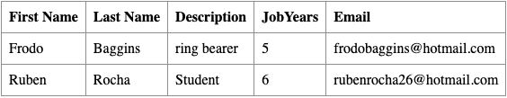
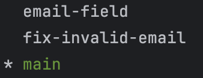
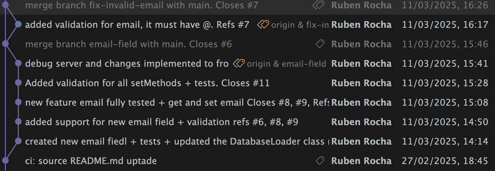
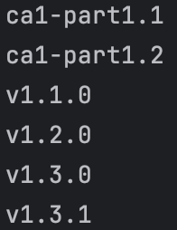
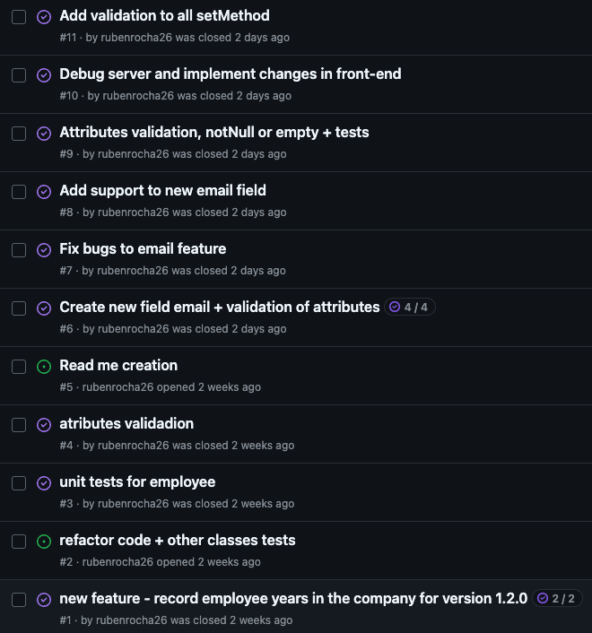

# _Part 1-VersionControl With Git_

## Introduction to Part 1

This section of the repository corresponds to the part 1 of the first class assignment (CA1) of the DevOps course in the Switch 24-25 program. 
It is divided into multiple parts, each focusing on different aspects of version control and development practices.

## Table of Contents

- [Part 1.1 Development Without Branches](#part-11-development-without-branches)
  - [Getting Started](#getting-started)
  - [Goals and Requirements](#goals-and-requirements)
  - [Implementation](#implementation)
    - [1.Copy the code of the Tutorial React.js and Spring Data REST Application into a new folder named `CA1/part1`](#1-copy-the-code-of-the-tutorial-reactjs-and-spring-data-rest-applicationhttpsgithubcomspring-attictut-react-and-spring-data-resttreemainbasic-into-a-new-folder-named-ca1part1)
    - [2.Commit the changes (and push them)](#2-commit-the-changes-and-push-them)
    - [3.Tagging the Repository to Mark the Application Version](#3-tagging-the-repository-to-mark-the-application-version)
    - [4.Developing a New Feature: Adding a New Field to the Application](#4-developing-a-new-feature-adding-a-new-field-to-the-application)
    - [5.Debugging the Server and Client Components](#5-debugging-the-server-and-client-components)
    - [6.End of the assignment](#6-end-of-the-assignment)
---

- [Part 1.2 Development Using Branches](#part-12-development-using-branches)
  - [Goals and Requirements](#goals-and-requirements-1)
  - [Implementation](#implementation-1)
    - [1.Verifying the active Branch](#1-verifying-the-active-branch)
    - [2.Develop new features in branches](#2-develop-new-features-in-branches)
    - [3.Integration and Testing of the Email Field](#3-integration-and-testing-of-the-email-field)
    - [4.Merging the Code into the Master Branch](#4-merging-the-code-into-the-master-branch)
    - [5.Create a new branch to fix a bug](#5-create-a-new-branch-to-fix-a-bug)
    - [6.End of the assignment](#6-end-of-the-assignment-1)
---

- [Results](#results)
  - [Final State of The Application](#final-state-of-the-application)
  - [Repository Branch Overview](#repository-branch-overview)
  - [Project Tags Overview](#project-tags-overview)
  - [Issue Tracking](#issue-tracking)
    - [The Role of Issues in Project Management](#the-role-of-issues-in-project-management)
    - [Future Use of Issues](#future-use-of-issues)
  - [Reflections on the Development Process](#reflections-on-the-development-process)
---

- [Alternative Solution](#alternative-solution)
  - [Comparison of Mercurial and Git](#comparison-of-mercurial-and-git)
  - [Utilizing Mercurial for the Assignment](#utilizing-mercurial-for-the-assignment)
    - [1.Initial Repository Setup Import](#1-initial-repository-setup-and-import)
    - [2.Feature Development and Branch Management](#2-feature-development-and-branch-management)
    - [3.Continuous Integration: Commiting and Tagging](#3-continuous-integration-committing-and-tagging)
    - [4.Merging Features and Preparing for Deployment](#4-merging-features-and-preparing-for-deployment)
  - [Final Thoughts on Mercurial as an Alternative](#final-thoughts-on-mercurial-as-an-alternative)


- [Overall Conclusion](#overall-conclusion)


# Part 1.1 Development Without Branches

This part explores the development process without using branches, 
highlighting the challenges faced and solutions implemented.

## Getting Started

To begin, I cloned an existing repository that contained the Tutorial React.js and Spring Data REST application, ensuring I had a local copy of the tutorial project. 
Next, I established my own repository to store class assignments and track all modifications under version control.

**Setting Up My Repository:** I created a dedicated directory on my local machine for the DevOps class assignments and initialized it as a Git repository. This marked the initial step in organizing my project workspace.

```bash
mkdir ~/myDevOpsRepo
cd ~/myDevOpsRepo
git init
```

**Adding the Tutorial Application:** To integrate the tutorial application into my project, I copied its files into my repository. 
This step guaranteed that all necessary resources were included within my version control setup.
The tutorial application can be found at: [Tutorial Repository](https://github.com/spring-attic/tut-react-and-spring-data-rest/tree/main/basic)

```bash
cp -r ~/tutorial ~/myDevOpsRepo
```

**Connecting to GitHub:** Once the tutorial application was in place, I linked my local repository to a new GitHub repository. 
This connection enabled me to push updates to a remote server, ensuring both backup and accessibility.

```bash
git remote add origin <repository-URL>
```

**Initial Commit:** After setting up the repository and verifying the presence of all files, I staged and committed the README file. 
This first commit, labeled "add readme," marked the beginning of my work on the assignments. 

```bash
git add .
git commit -m "add readme"
```
**Commit Strategy:** After the initial commit, I implemented a structured approach to committing changes. 
Each commit follows a clear and consistent logic, ensuring better tracking and maintainability of the project:

- `ci:` for continuous integration updates.
- `test:` for adding new tests or fixing existing ones.
- `feat:` for introducing new features.
- `fix:` for addressing and resolving bugs.

*Furthermore, all commits are referenced to GitHub issues, ensuring traceability and alignment with project tasks.*

**Pushing to Remote:** Lastly, I pushed my initial commit to the GitHub repository, officially initiating the version history for my assignments in a remote location.


```bash
git push -u origin master
```

---

## Goals and Requirements

- The first part of the assignment focuses on understanding and using basic version control operations without branching.
- Tasks involve setting up the project environment, making changes directly to the main branch, and committing those modifications.
- An essential requirement is to add a new feature (e.g., introducing a jobYears field to the Employee object) and ensuring proper version tagging, starting with an initial version and updating it after adding the new feature.
- The emphasis is on practicing commits, understanding commit history, and using tags for version management.


## Implementation

In the initial phase, all development was carried out on the master branch. The process involved:

### 1. **Copy the code of the [Tutorial React.js and Spring Data REST Application](https://github.com/spring-attic/tut-react-and-spring-data-rest/tree/main/basic) into a new folder named `CA1/part1`**

These commands were used to create a new directory and subdirectory named `CA1/part1`and copy the tutorial director recursively to `CA1/part1`:

```bash
mkdir CA1/part1
cp -r ~/myDevOpsRepo/tutorial ~/myDevOpsRepo/CA1/part1
```

---

### 2. **Commit the changes (and push them)**

Once the `CA1/part1` directory was set up with the Tutorial application, I proceeded to create a .gitignore file to prevent some files to be pushed into the central repository.
After that I commited these changes to the master branch with the following commands:

```bash
git add .
git commit -m "ci: add folder CA1/part1 with Tutorial"
git push
```

---

### 3. **Tagging the Repository to Mark the Application Version**

To track the application's version, I followed the versioning pattern specified in the assignment: major.minor.revision. 
The initial setup was tagged as v1.1.0, and this tag was then pushed to the remote repository using the following commands:

```bash
git tag v1.1.0 -m "Version 1.1.0"
git push origin v1.1.0
```

---

### 4. **Developing a New Feature: Adding a New Field to the Application**

The primary goal of this phase was to introduce a new feature by adding a jobYears field to the application. 
This field records the number of years an employee has been with the company.

Additionally, I implemented unit tests to ensure the correct creation of employees and validation of their attributes. 
These tests specifically enforce that:

- The **jobYears** field only accepts integer values.
- String-type fields cannot be null or empty.

To incorporate this new feature, the following files were modified:

- `Employee.java`

This Java class, which represents the employee model, was updated to include a new integer field named **jobYears**. 
The changes involved:

- Adding the **jobYears** field.
- Implementing getter and setter methods to maintain data encapsulation and controlled access.
- Validating all parameters to ensure data integrity.

Below are the key additions and modifications made to the `Employee` class to support this new functionality and ensure robust data validation:

```java
import org.springframework.data.annotation.Id;
import javax.persistence.Entity;
import javax.persistence.GeneratedValue;

/**
 * @author Ruben Rocha
 */
// tag::code[]
@Entity
public class Employee {

  private @Id
  @GeneratedValue Long id;
  private String firstName;
  private String lastName;
  private String description;
  private int jobYears;
  
  //Empty Constructor
  public Employee(){}
  
  //Constructor
  public Employee(String firstName, String lastName, String description, int jobYears) {

    if (isAttributeInvalid(firstName)) {
      throw new IllegalArgumentException("FirstName cannot be empty or null");
    }
    this.firstName = firstName;

    if (isAttributeInvalid(lastName)) {
      throw new IllegalArgumentException("LastName cannot be empty or null");
    }
    this.lastName = lastName;

    if (isAttributeInvalid(description)) {
      throw new IllegalArgumentException("Description cannot be empty or null");
    }
    this.description = description;

    if (jobYears < 0) {
      throw new IllegalArgumentException("JobYears cannot be negative");
    }
    this.jobYears = jobYears;
  }

  @Override
  public boolean equals(Object o) {
    if (this == o) return true;
    if (o == null || getClass() != o.getClass()) return false;
    Employee employee = (Employee) o;
    return Objects.equals(id, employee.id) &&
            Objects.equals(firstName, employee.firstName) &&
            Objects.equals(lastName, employee.lastName) &&
            Objects.equals(description, employee.description) &&
            Objects.equals(jobYears, employee.jobYears);
  }

  @Override
  public int hashCode() {
    return Objects.hash(id, firstName, lastName, description, jobYears);
  }
  
  //Getters and Setters
  public Long getId() {return id;}

  public void setId(Long id) {this.id = id;}

  public String getFirstName() {return firstName;}

  public void setFirstName(String firstName) {
    if (isAttributeInvalid(firstName)) {
      throw new IllegalArgumentException("First Name cannot be empty or null");
    }
    this.firstName = firstName;
  }

  public String getLastName() {return lastName;}

  public void setLastName(String lastName) {
    if (isAttributeInvalid(lastName)) {
      throw new IllegalArgumentException("Last Name cannot be empty or null");
    }
    this.lastName = lastName;
  }

  public String getDescription() {return description;}

  public void setDescription(String description) {
    if (isAttributeInvalid(description)) {
      throw new IllegalArgumentException("Description cannot be empty or null");
    }
    this.description = description;
  }

  public int getJobYears() {return jobYears;}

  public void setJobYears(int jobYears) {
    if (jobYears < 0) {
      throw new IllegalArgumentException("JobYears cannot be negative");
    }
    this.jobYears = jobYears;
  }

  @Override
  public String toString() {
    return "Employee{" +
            "id=" + id +
            ", firstName='" + firstName + '\'' +
            ", lastName='" + lastName + '\'' +
            ", description='" + description + '\'' +
            ", jobYears='" + jobYears + '\'' +
            '}';
  }

  private boolean isAttributeInvalid(String attribute){
    if(attribute==null || attribute.isEmpty()){
      return true;
    }
    return false;
  }
}
// end::code[]
```
- `EmployeeTest.java`

To ensure the reliability of the newly introduced jobYears field, the EmployeeTest.java file was updated with comprehensive unit tests. 
The key testing aspects include:

- **Validation Tests:** Confirmed that the constructor and setter methods correctly reject invalid inputs, such as null or empty strings and negative values for jobYears, preventing improper object creation.
- **Positive Scenarios:** Verified that valid inputs allow successful object creation without exceptions, ensuring that the `Employee class functions correctly under normal usage.
- **Equality and Hashing:** Tested the proper implementation of the `equals` and `hashCode` methods to ensure accurate object comparison and correct behavior in collections.
- **String Representation:** Evaluated the `toString` method to confirm that it accurately represents `Employee` object details, improving readability for debugging and logging.

Here are some examples of my tests:

```java
class EmployeeTest {
    @Test
    void shouldCreateEmployeeWithAllArgs() {
        //arrange
        //act
        Employee employee = new Employee("Ruben", "Rocha", "Student", 5);
        //assert
        assertNotNull(employee);
    }

  @Test
  void emptyFirstNameShouldThrowException(){
    //arrange
    //act
    //assert
    assertThrows(Exception.class, () -> new Employee("","Rocha", "Student", 5));
  }

  @Test
  void negativeJobYearsShouldThrowException(){
    //arrange
    //act
    //assert
    assertThrows(Exception.class, () -> new Employee("Ruben","Rocha", "Student",-1));
  }

  @Test
  void shouldReturnTrueIfSameEmployeeAttributes(){
    //arrange
    Employee employee = new Employee("Ruben", "Rocha", "Student", 5);
    Employee employee2 = new Employee("Ruben", "Rocha", "Student", 5);
    //act
    boolean result = employee.equals(employee2);
    //assert
    assertTrue(result);
  }

  @Test
  void shouldReturnSameHashCodeForEqualEmployees() {
    // arrange
    Employee employee1 = new Employee("Ruben", "Rocha", "Student", 5);
    Employee employee2 = new Employee("Ruben", "Rocha", "Student", 5);

    employee1.setId(1L);
    employee2.setId(1L);

    // act
    int hashCode1 = employee1.hashCode();
    int hashCode2 = employee2.hashCode();

    // assert
    assertEquals(hashCode1, hashCode2);
  }

  @Test
  void whenSetWithEmptyFirstNameThrowsException() {
    //arrange
    String firstName = "";
    Employee employee1 = new Employee("Ruben", "Rocha", "Student", 5);
    //act+assert
    assertThrows(Exception.class, () -> employee1.setFirstName(firstName));
  }

  @Test
  void whenSetWithNegativeJobYearsThrowsException(){
    //arrange
    int jobYears = -1;
    Employee employee1 = new Employee("Ruben", "Rocha", "Student", 5);
    //act+assert
    assertThrows(Exception.class, () -> employee1.setJobYears(jobYears));
  }

  @Test
  void shouldReturnEmployeeToString(){
    //arrange
    Employee employee1 = new Employee("Ruben", "Rocha", "Student", 5, "rubenrocha26@hotmail.com");
    employee1.setId(1L);
    //act
    String result = employee1.toString();
    // assert
    String expected = "Employee{id=1, firstName='Ruben', lastName='Rocha', description='Student', jobYears='5'}";
    assertEquals(expected, result);
  }   
}
```

- `DatabeseLoader.java`

The `DatabaseLoader.java` class, responsible for pre-loading the database with sample data, was modified to include jobYears information for sample employees. 
This update ensures that the application can demonstrate the functionality of the new field from the very beginning.

Below is a code snippet illustrating the modifications made to `DatabaseLoader` to incorporate jobYears for the sample employees:

```java
import org.springframework.beans.factory.annotation.Autowired;
import org.springframework.boot.CommandLineRunner;
import org.springframework.stereotype.Component;

/**
 * @author Ruben Rocha
 */
// tag::code[]
@Component // <1>
public class DatabaseLoader implements CommandLineRunner { // <2>

	private final EmployeeRepository repository;

	@Autowired // <3>
	public DatabaseLoader(EmployeeRepository repository) {
		this.repository = repository;
	}

	@Override
	public void run(String... strings) throws Exception { // <4>
		this.repository.save(new Employee("Frodo", "Baggins", "ring bearer", 5));
		this.repository.save(new Employee("Ruben", "Rocha", "Student", 6));
	}
}
// end::code[]
```

- `app.js`

The React components within `app.js were updated to support the display of the newly introduced jobYears field in the employee list.

Specifically, the `EmployeeList` and `Employee` components were modified to include a "Job Years" column in the rendered table. This allows users to view the number of years an employee has been with the company alongside their other details.

Below is a code snippet illustrating the modifications made to app.js to integrate the jobYears field into the application's frontend:

```js
class EmployeeList extends React.Component{
  render() {
    const employees = this.props.employees.map(employee =>
            <Employee key={employee._links.self.href} employee={employee}/>
    );
    return (
            <table>
              <tbody>
                <tr>
                  <th>First Name</th>
                  <th>Last Name</th>
                  <th>Description</th>
                  <th>JobYears</th>
                </tr>
                {employees}
              </tbody>
            </table>
    )
  }
}
```

```js
class Employee extends React.Component{
  render() {
    return (
            <tr>
              <td>{this.props.employee.firstName}</td>
              <td>{this.props.employee.lastName}</td>
              <td>{this.props.employee.description}</td>
              <td>{this.props.employee.jobYears}</td>
            </tr>
    )
  }
}
```

---

### 5. **Debugging the Server and Client Components**

After verifying the integration of the jobYears field, I ran the application using the command: `./mvnw spring-boot:run`

This allowed me to test its real-time functionality at http://localhost:8080/. 
This step was essential for hands-on testing within the application's interface, ensuring smooth operation and compatibility with existing features.

To further validate the implementation, I leveraged **React DevTools** to inspect component hierarchies, track state updates, and confirm that the jobYears field was correctly managed within the React components. 
This tool was particularly useful in debugging data flow issues and ensuring seamless interaction between the frontend and backend.

Simultaneously, I conducted a comprehensive code review to:

- Verify **server-side data handling,** ensuring that the **jobYears** field was correctly processed and stored.
- Confirm **client-side representation,** making sure that **jobYears** was accurately displayed in the UI and updated dynamically.

By combining real-time testing, **React DevTools**, and meticulous code review, I ensured the correctness of the feature while maintaining high code quality and system reliability.

---

### 6. **End of the assignment**

Once I was satisfied with the stability and performance of the new feature, I committed the changes to the repository with a descriptive message outlining the enhancements. 
After that, I pushed the updated code to the remote repository.

To formally mark this significant update, I tagged the commit as `v1.2.0`, adhering to the semantic versioning pattern established for the project. 
Additionally, at the conclusion of the assignment, I tagged the repository with `ca1-part1.1`, providing a clear reference point for this specific phase of development.

---

# Part 1.2 Development Using Branches

The second phase focuses on leveraging branches for feature development and bug fixes, emphasizing isolated development environments and efficient merge strategies.

## Goals and Requirements

- **Feature Branches:** All new developments and bug fixes must be implemented in dedicated feature branches, ensuring that ongoing changes do not interfere with the main codebase until they are fully tested and ready to be merged.

- **Merge Strategies:** Proper merge techniques should be applied to integrate feature branches seamlessly, maintaining code stability and avoiding conflicts.

- **Version Tagging:** After successful merges, the master branch is tagged to mark new versions of the application, demonstrating effective branch management and structured version control.

This approach enhances collaboration, ensures code integrity, and facilitates smooth feature integration throughout the development process.

---

## Implementation

In the second phase, the focus shifted towards **branch-based development** to enhance the application's features and address existing bugs, ensuring that the master branch remained stable for publishing reliable versions of the **Tutorial React.js and Spring Data REST Application**.

The process for adding new features and fixing bugs follows a similar approach to Part 1.1. 
To avoid redundancy, I will not include all the code again. 
However, the key distinction in this phase is the strategic use of branches to maintain a clean and organized development workflow.

**Main Steps:**

### 1. **Verifying the active Branch**

To ensure that I was working in the correct branch—particularly the master branch for publishing stable versions—I utilized the following command:
```bash
git branch
```

This step was essential in the second phase, as it allowed me to confirm my current working branch. In the command output, the active branch is marked with an asterisk (*), providing a clear indication of my development context and helping maintain an organized workflow.

---

### 2. **Develop new features in branches**

During the development phase of adding an **email field** to the application, effective **branch management** played a crucial role. 
The process began by creating a dedicated **feature branch**, ensuring that all changes related to this feature were isolated from the main codebase.

To encapsulate all developments related to the **email field feature**, I created a new branch named e**mail-field** and switched to it before starting the implementation. 
To confirm that I was working in the correct branch, I used the `git branch` command, which helped verify the active development context.

```bash
git branch email-field
git checkout email-field
git branch
```

This structured approach ensured that all modifications remained contained within the email-field branch until they were fully developed, tested, and ready for integration.

---

### 3. **Integration and Testing of the Email Field**

The process of integrating support for the **email field** and ensuring robust validation closely followed the approach used for the **jobYears** field in Part 1.1. 
Below are the key steps taken to implement and validate this feature:

- **Code Implementation:**

Following the existing development pattern, I extended the `Employee` class to include an **email field**, along with its corresponding **getter and setter** methods. 
This required updating the **data models**, **forms**, **and views** to seamlessly integrate the new field across both the frontend and backend.

- **Unit Testing**

To maintain high reliability, I developed comprehensive **unit tests** to verify:

- The correct creation of `Employee` instances with the **email field**.
- Validation rules enforcing that the **email** attribute cannot be `null` or `empty`, ensuring data integrity.

- **Debugging**

The **server and client** components underwent thorough debugging to identify and resolve any issues resulting from the addition of the **email field**. 
This step was critical to ensuring **seamless** operation, proper data **handling**, and an **optimal user experience**.

---

### 4. **Merging the Code into the Master Branch**

The completion of the **email field feature** involved a structured process to integrate the changes into the **main branch** and update the application's version.

**Key Steps:**

- **Commit and Push the Feature Branch**

After finalizing the **email-field implementation**, the changes were committed and the branch was pushed to the **remote repository**, preparing it for integration.

- **Merging into the Main Branch**

To ensure a well-maintained commit history, a **no-fast-forward merge** was performed, preserving the development timeline and branch history.

- **Updating the Remote Repository**

Once the merge was complete, the changes were pushed to the remote repository, officially updating the **main branch** with the new feature.

- **Tagging the New Version**

To mark this significant update, a new version tag was created and pushed, maintaining a structured versioning system.

**Commands Used:**

```bash
# Commit the feature changes
git add .
git commit -m "feat: email field added"

# Push the feature branch upstream
git push --set-upstream origin email-field

# Switch to the main branch and merge changes
git checkout main
git merge --no-ff email-field

# Push the merged changes to update the main branch
git push 

# Tag the new version and push the tag
git tag v1.3.0 -m "Added email field feature"
git push origin v1.3.0
```

By following this structured approach, the **email field** feature was successfully integrated while ensuring version control integrity and maintaining a clear development history.

---

### 5. **Create a new branch to fix a bug**

To address the **email validation bug** in the `Employee` class, a dedicated branch named **fix-invalid-email** was created, following the established workflow for bug fixes. 
The **development, testing, and merging processes** were carried out in alignment with previous features and fixes, ensuring **code integrity and application stability**.

The core of this bug fix involved enhancing the **Employee** class with validation logic to enforce proper email formatting, specifically ensuring that the email field contains an **"@" sign**. 
This update prevents invalid email entries and enhances data reliability.

Below is the **validation** logic implemented:

```java
private boolean isEmailInvalid(String email){
    if(email==null || email.isEmpty()){
        return true;
    }
    return !email.matches(".*@.*");
}
```

By applying this fix within a structured **branch-based development workflow**, the application maintains its robustness while ensuring that only properly formatted emails are accepted.

---

### 6. **End of the assignment**

After implementing the **email validation fix** and conducting thorough testing to ensure its effectiveness, the changes were successfully merged into the **master branch**.

To reflect this minor but essential improvement, the **application version was updated to v1.3.1**, following semantic versioning conventions. 
This version increment underscores the **continuous enhancement** of the application's functionality and reliability.

At the conclusion of the assignment, **the repository was tagged with ca1-part1.2**, marking the completion of this development phase and providing a clear reference point for future iterations.

---

# Results

## Final State of the Application

The final state of the application, following the implementation of all new features, is illustrated below:



In our employee model, the fields **"First Name", "Last Name", and "Description"** were pre-existing components and remained unchanged throughout this project.

During **Part 1.1 of CA1, the "Job Years"** field was introduced to track employees' tenure within the company.

The latest enhancement, implemented in **Part 1.2 of CA1**, involved adding the "Email" field, further enriching the employee data model by incorporating essential contact information.

With these improvements, the application now provides a more comprehensive employee profile, enhancing **data accuracy, usability, and overall functionality**.

---

## Repository Branch Overview



The image above displays the **current branches** within the repository, as revealed by executing the following command:

```bash
git branch
```

Additionally, the subsequent image illustrates the **chronological** sequence of branches, highlighting the most recent contributions made to the repository.



Through this assignment, I gained valuable insights into the importance of using **branches** to isolate changes related to specific features or fixes. 
This approach not only ensures the stability of the **main codebase** but also provides a **clear and organized history** of modifications, facilitating better collaboration and version control.

---

## Project Tags Overview

Below is a visual representation of the project's tags, generated using the following command:

```bash
git tag
```


The use of **tags** provided valuable insight into how to mark **significant points** in the project's history. 
This practice is essential for:

- Tracking project **progress** over time.
- **Facilitating version control**, ensuring each release or milestone is clearly identifiable.
- **Enabling quick rollbacks**, allowing developers to revert to previous stable versions when necessary.

By incorporating tags, the project maintains a well-structured and easily navigable **versioning system**, improving overall development workflow and reliability.

---

## Issue Tracking

Throughout the development process, multiple **GitHub issues** were created to track and manage various tasks, including bug fixes and feature implementations. 
These issues were systematically **addressed** and **closed** through commits **linked directly** to their respective tasks. 
This approach not only ensures a **clear history of the project's evolution but also streamlines the workflow by automatically resolving issues when their corresponding changes are merged into the repository**.

Below is a visual **representation** of the issues that were created and successfully resolved during this assignment:



---

### The Role of Issues in Project Management

Issues play a crucial role in software development, as they help:

- **Track bugs**, ensuring that problems are identified and resolved efficiently.
- **Manage feature development**, documenting planned enhancements.
- **Organize tasks**, keeping development structured and prioritized.
- **Facilitate collaboration**, allowing tasks to be assigned to team members.
- **Enhance traceability**, linking issues to specific commits and pull requests.

---

### Future Use of Issues

In future assignments, the **goal** is to leverage issue tracking throughout the **entire development cycle**, improving task management, progress tracking, and team coordination.

---

## Reflections on the Development Process

This section provides a **comprehensive overview** of the application's evolution, highlighting:

- The **addition of new features**.
- The **structured use of branching** for development.
- The **marking of significant milestones** using tags.

The visual **representations** of the repository’s **branches, tags, and issues** illustrate the **practical application of version control and project management techniques**. 
By integrating **issue tracking**, the project maintains a well-documented and organized history, ensuring a scalable and efficient **development process**.

---

# Alternative Solution 

## Comparison of Mercurial and Git

| **Feature**          | **Mercurial (Hg)**                                     | **Git**                                          |
|----------------------|------------------------------------------------------|--------------------------------------------------|
| **Architecture**     | Distributed model, where each developer has a full copy of the repository. | Distributed architecture, enabling multiple full-version repositories for enhanced redundancy and collaboration. |
| **Versioning Model** | Uses a changeset-based approach, recording each commit as a unique identifier, ensuring full traceability. | Adopts a snapshot-based approach, encapsulating the state of the entire repository at each commit for comprehensive tracking. |
| **Branching and Merging** | Provides lightweight branching and intuitive merging capabilities, with built-in features like named branches and bookmarks. | Offers efficient branching and merging capabilities, ideal for parallel development workflows. |
| **Binary Files Handling** | Handles binary files efficiently through revlogs, reducing storage impact and optimizing performance. | Stores complete binary files per change, which may increase repository size but ensures ease of access to all versions. |

---

## Utilizing Mercurial for the Assignment

The following sections describe how **Mercurial** could be used to accomplish the same tasks outlined in this assignment.

### 1. Initial Repository Setup and Import
The first step involves creating a **distributed Mercurial repository** to store the **Tutorial React.js and Spring Data REST application**, ensuring full version control across all development environments.

```bash
# Initialize a new Mercurial repository
hg init /path/to/hg_repository

# Add all project files to the repository
cd /path/to/TutorialReactSpringDataREST
hg add

# Commit the initial version
hg commit -m "Initial import of the project"
```

---

### 2. Feature Development and Branch Management
Similar to Git, Mercurial supports **branching strategies** to keep feature development isolated. However, Mercurial offers two primary methods for branching: **named branches** (persistent) and **bookmarks** (similar to Git branches).

```bash
# Create and switch to a new feature branch
hg branch email-field
hg commit -m "Created email-field branch for feature development"
```

Alternatively, bookmarks can be used for a **lighter** branching approach:

```bash
hg bookmark email-field
hg update email-field
```

---

### 3. Continuous Integration: Committing and Tagging
Throughout development, commits are made to track progress. Once a stable version is reached, it is **tagged** to mark important milestones.

```bash
# Commit feature changes
hg commit -m "Implemented email field feature"

# Tag a stable release version
hg tag v1.0
hg commit -m "Tagging version 1.0"
```

---

### 4. Merging Features and Preparing for Deployment
After testing, the feature branch is merged back into the main branch (`default` in Mercurial).

```bash
# Switch to the main branch
hg update default

# Merge feature branch
hg merge email-field
hg commit -m "Merged email field feature into default branch"
```

Finally, the changes are pushed to the **remote repository** to synchronize development.

```bash
hg push
```

---

## Final Thoughts on Mercurial as an Alternative

By adapting **Mercurial** to the workflow used in this assignment, a development approach similar to **Git** can be achieved. Mercurial’s **simplicity, built-in branching mechanisms, and robust version tracking** make it a strong alternative for version control, ensuring an organized and reliable software development environment.

---

# Overall Conclusion

Completing the **Version Control with Git** assignment has significantly broadened my understanding of **version control systems** and their role in **software development**.

**Part 1.1** of the assignment reinforced the foundational concepts of version control, focusing on **direct modifications to the master branch**, along with the essential practices of **committing and tagging**. 
The transition to **Part 1.2**, which introduced **branching**, provided a deeper exploration of more complex scenarios, such as **feature additions and bug fixes**. 
This progression highlighted the importance of **isolating changes**, ensuring a **clearer project history** and **easier management**.

The **Results** section encapsulates the tangible outcomes of this learning experience, showcasing the application's enhanced functionality through the **successive addition of new features**. 
This visual portrayal underscores the **practical application of version control principles** in real-world software development scenarios.

The use of **GitHub issues** for **problem tracking and management** was also introduced and effectively utilized, offering a **clear history of issues and their solutions**. 
This practice demonstrated the **versatility and applicability** of issues in software development projects, reinforcing structured workflows.

Additionally, the exploration of **Mercurial as an Alternative Solution** to Git provided insights into different **version control paradigms**.

This assignment not only strengthened my **technical skills** in using **Git** and understanding **Mercurial**, but also underscored the **essential role of version control** in facilitating **collaborative development environments**, ensuring **code integrity**, and efficiently **managing project evolution**.
