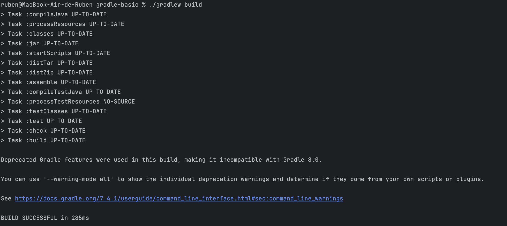

# _Part 2-Build Tools with Gradle_

Prerequisites
-------------

* Java JDK 8 (or newer)
* Apache Log4J 2
* Gradle 7.4.1 (if you do not use the gradle wrapper in the project)
---

## Introduction to Part 2

**This section of the repository corresponds to Part 2 of the first class assignment (CA1) of the DevOps course in the Switch 24-25 program.**
The primary focus of this assignment is to explore **Gradle as a build automation tool**, applying its features to streamline development workflows.  
Throughout the report, several tasks are covered, including **setting up the environment, creating and executing tasks, integrating unit tests, and managing files with Gradle’s automation capabilities**.

## Table of Contents

- [Environment Setup](#environment-setup)
- [Gradle Basic Demo](#gradle-basic-demo)
  - [Build Process](#build-process)
  - [Server Startup](#server-startup)
  - [Client Connections](#client-connections)
- [Implementation](#implementation)
  - [Add a new task to execute the server](#add-a-new-task-to-execute-the-server)
  - [Add unit tests for the server execution task](#add-unit-tests-for-the-server-execution-task)
  - [Add a new task of type Copy](#add-a-new-task-of-type-copy)
  - [Add a new task of type Zip](#add-a-new-task-of-type-zip)
- [Conclusion](#conclusion)
---

## Environment Setup

The initial step involved creating a new directory for this assignment, `/CA1/Part2`, followed by cloning the example application from the provided **Bitbucket repository**. 
This repository included a `build.gradle` file and the **Gradle Wrapper**, ensuring a consistent build environment.
After installation, I verified Gradle’s setup by running the following command in the terminal:

```bash
gradle -v
```

Next, I integrated the project into my **Integrated Development Environment (IDE)**, which supports **Gradle**, leveraging its built-in features. 
To ensure the project was correctly configured and ready for development, I executed a basic **Gradle build**:

```bash
./gradlew build
```

This step was essential for validating that all dependencies and configurations were properly set up, ensuring a smooth transition to subsequent development tasks.

## Gradle Basic Demo

The **Gradle Basic Demo** provided a hands-on exercise in working with a **multi-threaded chat server**, capable of managing multiple clients simultaneously.

#### Build Process

To prepare the demo for execution, I ran the following command from the project’s root directory:

```bash
./gradlew build
```

This command compiled the source code and packaged it into an executable `.jar` file. The screenshot below confirms the successful build process.

   

#### Server Startup

Once the build was complete, I launched the chat server using the following command:

```bash
java -cp build/libs/basic_demo-0.1.0.jar basic_demo.ChatServerApp 59001
```

This initialized the server, making it ready to accept client connections. The screenshot below captures the server running and waiting for incoming client requests.


#### Client Connections

For the client side, I established connections to the chat server by executing:

```bash
./gradlew runClient
```

Each client connected to `localhost` on port `59001`. 


The `build.gradle` file was configured to allow easy modifications to connection settings if needed.
To demonstrate the server’s ability to handle multiple clients, I launched several client instances from different terminals. 
The screenshots above illustrate active chat sessions, confirming the successful **multi-client functionality** of the application.
---

## Implementation

### Add a new task to execute the server

To enhance the development workflow, I introduced a **runServer** task in the `build.gradle` file, simplifying the process of starting the chat server. 
This new task allows the server to be launched directly via a Gradle command, eliminating the need for manual command-line inputs each time the server is started.

The **runServer** task is defined as follows, using `JavaExec` to execute Java applications. 
It depends on the `classes` task, ensuring that all necessary classes are compiled before the server starts. 
The task is configured to launch the `ChatServerApp` main class on port `59001`:

```gradle
task runServer(type: JavaExec, dependsOn: classes) {
    group = "DevOps"
    description = "Launches a chat server that listens on port 59001"

    classpath = sourceSets.main.runtimeClasspath

    mainClass = 'basic_demo.ChatServerApp'

    args '59001'
}
```

To test this new functionality, I executed the task using the following command:

```bash
./gradlew runServer
```

The terminal output confirmed the successful execution of the task, as shown in the screenshot below, verifying that the server was running as expected.


This enhancement has significantly streamlined the development process by reducing the number of steps required to start the server.
Integrating this task into the Gradle build script not only highlights Gradle’s adaptability as a **build tool** but also improves the **overall productivity** of the project by automating routine tasks.

### Add unit tests for the server execution task

To ensure the **App** class functions as expected, I implemented a **unit test** within a new directory:

```
src/test/java/basic_demo
```

The test file, `AppTest.java`, was created to verify that the **App class provides a non-null greeting message**, ensuring this fundamental feature behaves as expected.

#### Configuring the Test Environment

To enable unit testing, I added the **JUnit dependency** to the `build.gradle` file:

```gradle
testImplementation 'junit:junit:4.12'
```

This ensures that **JUnit tests** are properly recognized and executed within the Gradle build process.

#### Implementing the Test

The following is the content of `AppTest.java`, which contains the test case:

```java
package basic_demo;

import org.junit.Test;
import static org.junit.Assert.*;

public class AppTest {
    @Test 
    public void testAppHasAGreeting() {
        App classUnderTest = new App();
        assertNotNull("app should have a greeting", classUnderTest.getGreeting());
    }
}
```

#### Running the Unit Test

To execute the test, I ran the following command:

```bash
./gradlew test
```

The terminal output confirmed that the test **passed successfully**, as shown in the screenshot below.


By integrating unit tests into the Gradle build process, this step **ensures the reliability of the application** and reinforces **best practices 
in software development** by detecting potential issues early in the development cycle.

### Add a new task of type Copy

To improve project reliability and ensure a **backup mechanism**, I introduced a **backup** task in the `build.gradle` file. 
This task leverages Gradle’s **Copy** task type to create a snapshot of the project's source code, allowing for quick recovery in case of unexpected issues during development.

The **backup task** is defined as follows, replicating the contents of the `src` directory into a designated backup location:

```gradle
task backup(type: Copy) {
    group = "DevOps"
    description = "Copies the sources of the application to a backup folder"

    from 'src'
    into 'backup'
}
```

#### Executing the Backup Task

After implementing the task, I tested its functionality by executing the following command:

```bash
./gradlew backup
```

The terminal output confirmed that the task **executed successfully**, as demonstrated in the screenshot below. 
This verification ensured that the source code was successfully copied to the **backup** directory, validating the task’s effectiveness in safeguarding the project’s codebase.


Although the `backup` folder is not committed to the remote repository, it is successfully generated in my **local development environment**. 
A quick inspection of my local file system confirmed the presence of the backup folder after executing the task, as shown in the screenshot below.


#### Impact of the Backup Task

The addition of the **backup** task to the Gradle build script has significantly improved the project's **resilience** by automating source code backups. 
This ensures that developers always have a reliable recovery point before making substantial changes or updates to the project.

### Add a new task of type Zip

The final step involved creating a **task of type Zip** to package the project’s source code into a **compressed `.zip` file**. 
This task simplifies the process of archiving the `src` directory, making it useful for **backups** or **distribution**.

The **archive task** is defined as follows:

```gradle
task archive(type: Zip) {
    group = "DevOps"
    description = "Creates a zip archive of the source code"

    from 'src'
    archiveFileName = 'src_backup.zip'
    destinationDir(file('build'))
}
```

#### Executing the Zip Task

To test the **archive task**, I executed the following command:

```bash
./gradlew archive
```

The terminal output confirmed the task’s successful execution, with the `src` directory being compressed into a **ZIP archive**. 
Below is a screenshot of the terminal output following task completion, demonstrating the archive creation.


#### Impact of the Zip Task

Although the ZIP file is **not committed to the remote repository**, it was successfully generated in my **local development environment**. 
Upon execution, the `src_backup.zip` file was found in the **build directory**, confirming the task’s functionality.


This task simplifies archiving by packaging the `src` directory into a `.zip` file, ensuring easy storage, distribution, and version control.

The report concludes with the **Conclusion** section, reflecting on the **learning outcomes**, the **challenges faced**, and the **practical skills acquired** in utilizing Gradle for **software development automation**.

---

## Conclusion

The completion of this assignment provided valuable insights into the **practical applications of Gradle** as a build tool. 
The tasks performed throughout the assignment emphasized **Gradle’s adaptability and versatility** in automating development workflows.

The **automation of build processes**, **integration of unit tests**, and **execution of file manipulation tasks** demonstrated Gradle's capabilities in maintaining a **robust and efficient development pipeline**. 
The addition of new tasks to the `build.gradle` file showcased its **extensibility**, enabling the customization of the build process to suit project-specific requirements.

The implementation of tasks such as **runServer, backup, and archive** streamlined the development process by reducing manual interventions while improving **project resilience** and **distribution capabilities**. 
Additionally, the **integration of unit testing** reinforced best practices in software development, emphasizing the importance of **test automation** and how Gradle facilitates this process.

Overall, the knowledge and skills gained from this assignment have enhanced my **understanding of Gradle’s role** in modern software development. 
This experience will be beneficial in future projects, enabling the creation of **more efficient, reliable, and scalable development workflows**.
