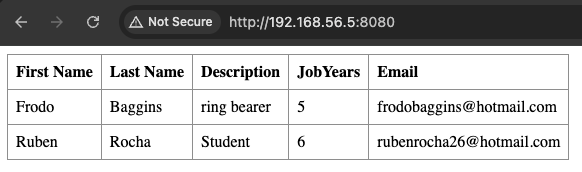

# _Part 1 - Virtualization with UTM_

## Introduction to Part 1

This report presents the procedures and outcomes of **Class Assignment 2 – Part 1**, which focuses on virtualization techniques using **VirtualBox**, as part of the DevOps course.
The primary objective of this assignment was to develop practical skills in configuring and managing virtual environments—an essential component in contemporary software development and IT operations.
Throughout the document, I outline the steps taken to create and configure a virtual machine, establish the development environment, and carry out various project-related tasks within the virtualized setup.

## Table of Contents
- [Setting Up](#setting-up)
  - [Virtual Machine Setup - For MAcBook Apple Silicon](#virtual-machine-setup--macos-apple-silicon)
  - [Network and Services Configuration — UTM on macOS](#network-and-services-configuration--utm-on-macos)
    - [Host-Only Networking in UTM](#host-only-networking-in-utm)
    - [Network Configuration in the VM (Ubuntu 18.04)](#network-configuration-in-the-vm-ubuntu-1804)
    - [Remote Connection Configuration](#remote-connection-configuration)
- [Clone the Repository](#clone-the-repository)
- [Development Environment Setup](#development-environment-setup)
  - [System Update and Upgrade](#1-system-update-and-upgrade)
  - [Git Installation](#2-git-installation)
  - [Java Development Kit (JDK) and Java Runtime Environment (JRE) For Java-based projects, I installed both the JDK and JRE:](#3-java-development-kit-jdk-and-java-runtime-environment-jre-for-java-based-projects-i-installed-both-the-jdk-and-jre)
  - [Maven Installation](#4-maven-installation)
  - [Gradle Installation](#5-gradle-installation)
- [Running the Spring Boot Basic Project](#running-the-spring-boot-basic-project)
- [Running the Gradle_basic_Demo_Project](#running-the-gradle-basic-demo-project-)
- [Running the Gradle Spring Boot Basic Project](#running-the-gradle-spring-boot-basic-project)
-[Conclusion](#conclusion)
---

# Setting Up

This section provides a general overview of the steps taken to set up the virtual environment required for the assignment. 
It covers the process of creating and configuring a virtual machine, preparing the operating system, and adjusting the necessary network settings.
Given that the setup was performed on a **MacBook with Apple Silicon**, **UTM** was used as an alternative to VirtualBox due to compatibility reasons.

> 🔍 A more detailed step-by-step guide is available [here](tutorial/VMTutorial.pdf). This guide includes screenshots and additional configuration notes to assist with replication.

## Virtual Machine Setup — macOS (Apple Silicon)

The first step involved downloading and installing [UTM](https://mac.getutm.app/), a virtual machine manager compatible with Apple Silicon, and obtaining the [Ubuntu Server (ARM architecture)](https://ubuntu.com/download/server/arm) ISO image, which serves as the installation media.
After launching UTM, I created a new virtual machine by selecting **New**. 
I assigned an appropriate name and specified the system architecture and operating system version to match the downloaded Ubuntu Server ISO.
Next, I allocated sufficient memory to ensure stable performance—specifically, **2048 MB of RAM**—and created a virtual hard disk tailored to the expected requirements of the environment.
Under the **Storage** settings, I mounted the ISO image to the virtual CD/DVD drive. 
I then started the virtual machine and followed the on-screen instructions to install the operating system.
To prepare for a **minimal Ubuntu 18.04 installation**, I ensured the VM booted from the minimal ISO and adjusted the configuration accordingly.

Regarding network setup:
- **Network Adapter 1** was configured as **NAT** to provide the VM with internet access.
- **Network Adapter 2** was configured as a **Host-only Adapter**, enabling isolated communication with the host system.

> This setup ensured both internet connectivity and secure communication between the host and guest environments.

## Network and Services Configuration — UTM on macOS

Once the basic virtual machine setup was complete, I proceeded to configure the network and essential services to enhance the functionality and accessibility of the environment.

### Host-Only Networking in UTM

Using UTM’s built-in options, I set the **Network Mode** to `Host Only`. 
This configuration allows communication between the macOS host and the virtual machine while remaining isolated from external networks.

> You can access this setting by selecting the VM, going to **Edit → Network**, and choosing **Host Only** from the Network Mode dropdown.

In my setup, UTM automatically defined the following parameters:

- **Guest Network**: `192.168.56.0/24`
- **DHCP Range**: `192.168.56.100` to `192.168.56.253`

To assign a **static IP address** to the VM within this range, I selected an unused IP (e.g., `192.168.56.110`).

### Network Configuration in the VM (Ubuntu 18.04)

After booting into the newly installed Ubuntu Server virtual machine, I began by updating the package repositories to ensure access to the latest versions of available packages:

```bash
  sudo apt update
```

To support low-level network configuration and diagnostics, I installed the **net-tools** package using the following command:

```bash
sudo apt install net-tools
```

To assign a static IP address to the virtual machine, I manually edited the **Netplan** configuration file by executing:

```bash
sudo nano /etc/netplan/50-cloud-init.yaml
```

```yaml
network:
  ethernets:
    enp0s1:
      dhcp4: true
    enp0s2:
      addresses:
        - 192.168.56.5/24
  version: 2
```

After making the edits, I applied the changes using the command `sudo netplan apply`.

### Remote Connection Configuration

To remotely manage the VM, I installed and configured the OpenSSH server by running `sudo apt install openssh-server`. 
Subsequently, I enabled password authentication by editing the `/etc/ssh/sshd_config` file and uncommenting the line `PasswordAuthentication yes`. 
Finally, I restarted the SSH service using the command `sudo service ssh restart`.

I also set up an FTP server to transfer files to and from the VM by installing `vsftpd` with the command `sudo apt install vsftpd`. 
I enabled write access within the FTP server configuration by editing the `/etc/vsftpd.conf` file and uncommenting the line `write_enable=YES`. 
After making the changes, I restarted the service using the command `sudo service vsftpd restart`.

With the installation of SSH, it became possible to access the VM remotely through the Mac terminal using the command `ssh user@IP_address`, where "user" is the username and "IP_address" is the IP address of the VM.

---

## Clone the Repository

To clone the repository for this project, I used the following command:

```bash
git clone https://github.com/rubenrocha26/devops-24-25-1241924.git
```
--- 

## Development Environment Setup

After configuring the virtual machine and ensuring proper network access, I installed the essential tools required for the projects. 
Below is an overview of the steps taken:

### 1. **System Update and Upgrade**
To ensure all installed software was up-to-date, I executed the following commands to update the package repositories and upgrade the installed packages:

```bash
sudo apt update
sudo apt upgrade
```

### 2. **Git Installation**

Git was installed to enable version control and source code management:

```bash
sudo apt install git
```

### 3. Java Development Kit (JDK) and Java Runtime Environment (JRE) For Java-based projects, I installed both the JDK and JRE:

```bash
sudo apt install openjdk-17-jdk openjdk-17-jre
```

### 4. **Maven Installation**

Maven was installed to manage project dependencies and build Java applications:

```bash
sudo apt install maven
```

### 5. **Gradle Installation**

Gradle required additional steps for installation:

- Downloaded the Gradle binary distribution:

```bash
wget https://services.gradle.org/distributions/gradle-8.6-bin.zip
```

- Created a directory for Gradle and extracted the downloaded file:

```bash
sudo mkdir /opt/gradle
sudo unzip -d /opt/gradle gradle-8.6-bin.zip
```

- Configured the system `PATH` to include Gradle's `bin` directory by updating the `.bashrc` file:

```bash
echo "export GRADLE_HOME=/opt/gradle/gradle-8.6" >> ~/.bashrc
echo "export PATH=\$GRADLE_HOME/bin:\$PATH" >> ~/.bashrc
source ~/.bashrc
```
  
- Verification of Installed Tools:

To confirm that all tools were installed correctly and functioning as expected, I checked their versions using the following commands:

```bash
git --version
java --version
mvn --version
gradle --version
```

These steps ensured that the virtual machine was equipped with the necessary tools to build, manage, and test Java applications effectively.

---

## Running the Spring Boot Basic Project

As part of the prerequisites from earlier assignments, I successfully built and ran the basic Spring Boot tutorial project within the pre-configured virtual machine environment.

#### Steps Followed:

1. **Navigating to the Project Directory**  
I accessed the `basic` directory, which contains the complete Spring Boot application setup.

2. **Starting the Application**  
To launch the application, I executed the following command from the project directory:

```bash
./mvnw spring-boot:run
```

3. **Accessing the Application Externally**
To access the application from external devices (e.g., the host machine or others on the same network), I identified the virtual machine’s IP address using:

```bash
ip addr
```

I then opened the application in a browser using the following URL: http://192.168.56.5:8080/

4. **Verifying the Application**
The application loaded successfully in the browser, confirming that the backend was working correctly and that the Spring Boot framework was serving the application as expected.




---

## Running the Gradle Basic Demo Project 

In this section, I describe the process of building and running the `gradle_basic_demo` project. 
This task involved executing the project in two separate environments: the virtual machine and the host machine.


1. I navigated to the `gradle_basic_demo` directory within the virtual machine and built the project using the following command:

```bash
./gradlew build
```

To start the server component within the VM, I used the following command:

```bash
./gradlew runServer
```

2. Since the virtual machine was configured with Ubuntu Server and lacked a graphical desktop environment, it was not possible to run GUI applications—such as the project's chat client—directly within the VM.

To work around this limitation, I used a terminal on my **host machine**, cloned the `gradle_basic_demo` project locally, and navigated to its directory. 
I then executed the client component using the command below:

```bash
./gradlew runClient --args="192.168.56.5 59001"
```

3. I successfully opened two chat windows from the **host machine**, demonstrating the functionality of the client-server communication. 

4. The chat application performed as expected, with messages being sent and received in real time between clients.

A screenshot was taken to capture this interaction, clearly illustrating the active connection and data exchange facilitated by the configured network setup.


---

## Running the Gradle Spring Boot Basic Project

In this part of the assignment, I focused on building and running the same component of the `spring_boot_basic`, this time with gradle.

1. I navigated to the `basic` folder within the `gradle_basic_demo` directory and executed the following commands to build and run the application:

```bash
./gradlew build
./gradlew bootRun
```

This started the Spring Boot server, making the application accessible via the web through the configured IP address and port.

2. Once the server was running, I accessed the application by entering the following URL into a web browser: http://192.168.56.5:8080/


This URL directed me to the landing page of the Spring Boot application, hosted within the virtual machine. The successful page load confirmed that the server was operational and capable of handling client requests over the network.

---

## Conclusion

This technical report details the setup and execution of a virtual environment using VirtualBox for Class Assignment 2 Part 1. 
The assignment involved the creation of a virtual machine, its network and service configuration, and the deployment of essential development tools for software project execution.
The virtualization efforts undertaken provided valuable practical experience in configuring and managing virtual machines within a DevOps context. 
The successful execution of the `Spring Boot tutorial` and the `gradle_basic_demo` project within this environment effectively simulated real-world software deployment and operational scenarios.
Key outcomes from this assignment include a significantly enhanced understanding of network configuration in virtualized environments and the intricacies of software configuration on virtual platforms. 
Challenges encountered, such as configuring network interfaces and ensuring seamless communication between the host and guest machines, were successfully resolved, contributing to a more thorough comprehension of virtualization technologies.

In conclusion, the experiences gained from this assignment are crucial for developing the necessary skills to manage complex environments and will undoubtedly be beneficial for ongoing educational and professional growth in the field of DevOps.