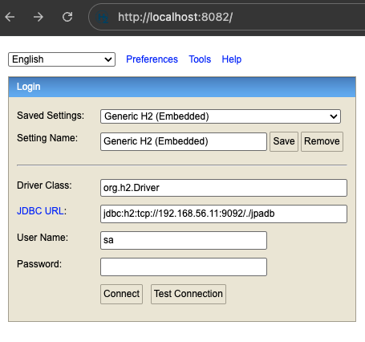
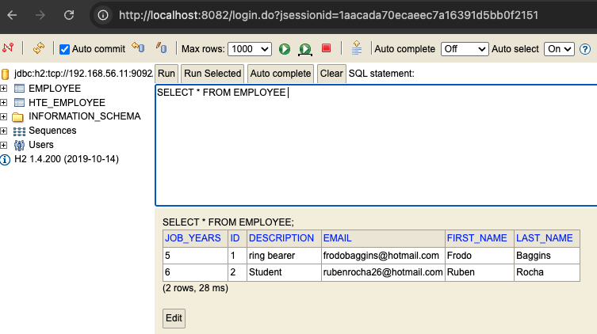

# _Part2 - Virtualization with Vagrant_

## Introduction to Part 2

This technical report documents the processes and outcomes of Class Assignment 2 - Part 2, focused on virtualization with Vagrant. 
The assignment required setting up a virtualized environment using Vagrant to run a Spring Boot application connected to an H2 database.

## Table of Contents
- [Environment Setup](#environment-setup)
- [Modification of the Vagrantfile for QEMU Compatibility](#modification-of-the-vagrantfile-for-qemu-compatibility)
- [Configuring Spring Boot for H2 Database Connectivity](#configuring-spring-boot-for-h2-database-connectivity)
- [Executing the Project within the Virtualized Environment](#executing-the-project-within-the-virtualized-environment)
- [Key Vagrant Commands Utilized](#key-vagrant-commands-utilized)
---

## Environment Setup

To set up a virtualized environment using Vagrant with QEMU on macOS, I followed these general steps:

**Download Vagrant:** I visited the [official Vagrant website](https://www.vagrantup.com/) and downloaded the appropriate version for my macOS system.

**Install Vagrant:** I ran the installer I downloaded from the Vagrant website. The installation process was straightforward; I simply followed the prompts provided by the installer.

**Verify Installation:** To ensure that Vagrant was installed correctly, I opened Terminal and ran the following command:

```bash
sudo vagrant --version
```

This command displayed the installed version of Vagrant, which confirmed that the installation was successful.

Update .gitignore: To keep my repository clean, I added the following lines to the .gitignore to prevent tracking the Vagrant-related directory and any .war files:

.vagrant/
*.war

Following the cloning of the base project, I proceeded to acquire the specific Vagrant configuration file relevant to my operating system. 
This file was accessed via the following [link](https://bitbucket.org/pssmatos/vagrant-multi-spring-tut-demo/src/master/), and in my case, the pertinent file was located within the `macOs` directory.

Subsequently, I established a dedicated directory structure, specifically `CA2/part2`, within my local file system. 
The contents downloaded from the aforementioned link were then strategically placed within this newly created directory to organize the project files appropriately for the subsequent virtualization setup using Vagrant and QEMU on macOS.

---

## Modification of the Vagrantfile for QEMU Compatibility

The `Vagrantfile` serves as the central configuration file defining the parameters and provisioning steps for the virtual machine. 
Following the initial setup, I implemented several critical modifications within the `Vagrantfile` to align it precisely with the specific demands of our project:

* **Repository URL Update:** The repository URL specified within the `Vagrantfile` was revised to reference the designated repository for this particular project.
* **Path Modification:** The file system paths referenced within the `Vagrantfile` were adjusted to accurately reflect the correct directory structure of our project.
* **Integration of `bootRun` Command:** To facilitate the execution of the Spring Boot application, the `./gradlew bootRun` command was explicitly added to the provisioning scripts within the `Vagrantfile`.
* **Java Version Upgrade:** The Java Development Kit (JDK) version utilized during the VM provisioning was updated to OpenJDK 17 to ensure compatibility and leverage the desired Java features. These modifications were crucial for establishing a virtual environment tailored for our Spring Boot application using Vagrant and QEMU on macOS.

Here's the updated Vagrantfile:

```ruby
Vagrant.configure("2") do |config|
  config.vm.box = "perk/ubuntu-2204-arm64"

  # This provision is common for both VMs
  config.vm.provision "shell", inline: <<-SHELL
    sudo apt-get -y update
    sudo apt-get install -y iputils-ping avahi-daemon libnss-mdns unzip \
         openjdk-17-jdk-headless
    # ifconfig
  SHELL

  #============
  # Configurations specific to the database VM
  config.vm.define "db" do |db|
    db.vm.box = "perk/ubuntu-2204-arm64"
    db.vm.hostname = "db"

    db.vm.provider "qemu" do |qe|
      qe.arch = "aarch64"
      qe.machine = "virt,accel=hvf,highmem=off"
      qe.cpu = "cortex-a72"
      qe.net_device = "virtio-net-pci"
      qe.memory = "512"
      qe.ssh_port = 50122
      qe.extra_qemu_args = %w(-netdev vmnet-host,id=vmnet,start-address=192.168.56.1,end-address=192.168.56.255,subnet-mask=255.255.255.0 -device virtio-net-pci,mac=52:54:00:12:34:50,netdev=vmnet)
    end

    # We want to access H2 console from the host using port 8082
    # We want to connet to the H2 server using port 9092
    db.vm.network "forwarded_port", guest: 8082, host: 8082
    db.vm.network "forwarded_port", guest: 9092, host: 9092

    # We need to download H2 and configure host-network
    config.vm.provision "shell", inline: <<-SHELL
      wget https://repo1.maven.org/maven2/com/h2database/h2/1.4.200/h2-1.4.200.jar
    SHELL

    # The following provision shell will run ALWAYS so that we can execute the H2 server process
    # This could be done in a different way, for instance, setiing H2 as as service, like in the following link:
    # How to setup java as a service in ubuntu: http://www.jcgonzalez.com/ubuntu-16-java-service-wrapper-example
    #
    # To connect to H2 use: jdbc:h2:tcp://192.168.33.11:9092/./jpadb
    db.vm.provision "file", source: "provision/netcfg-db.yaml", destination: "/home/vagrant/01-netcfg.yaml"
    db.vm.provision "shell", :run => 'always', inline: <<-SHELL
      sudo mv /home/vagrant/01-netcfg.yaml /etc/netplan
      chmod 600 /etc/netplan/01-netcfg.yaml
      sudo netplan apply
    
      java -cp ./h2*.jar org.h2.tools.Server -web -webAllowOthers -tcp -tcpAllowOthers -ifNotExists > ~/out.txt &
    SHELL
  end

  #============
  # Configurations specific to the webserver VM
  config.vm.define "web" do |web|
    web.vm.box = "perk/ubuntu-2204-arm64"
    web.vm.hostname = "web"

    web.vm.provider "qemu" do |qe|
      qe.arch = "aarch64"
      qe.machine = "virt,accel=hvf,highmem=off"
      qe.cpu = "cortex-a72"
      qe.net_device = "virtio-net-pci"
      qe.memory = "1G"
      qe.ssh_port = 50222
      qe.extra_qemu_args = %w(-netdev vmnet-host,id=vmnet,start-address=192.168.56.1,end-address=192.168.56.255,subnet-mask=255.255.255.0 -device virtio-net-pci,mac=52:54:00:12:34:51,netdev=vmnet)
    end

    # We want to access tomcat from the host using port 8080
    web.vm.network "forwarded_port", guest: 8080, host: 8080

    web.vm.provision "file", source: "provision/netcfg-web.yaml", destination: "/home/vagrant/01-netcfg.yaml"
    web.vm.provision "shell", inline: <<-SHELL, privileged: false
      sudo mv /home/vagrant/01-netcfg.yaml /etc/netplan
      chmod 600 /etc/netplan/01-netcfg.yaml
      sudo netplan apply
    
      #sudo apt-get install git -y
      #sudo apt-get install nodejs -y
      #sudo apt-get install npm -y
      #sudo ln -s /usr/bin/nodejs /usr/bin/node
      sudo apt install -y tomcat9 tomcat9-admin
      # If you want to access Tomcat admin web page do the following:
      # Edit /etc/tomcat9/tomcat-users.xml
      # uncomment tomcat-users and add manager-gui to tomcat user

      # Change the following command to clone your own repository!
      git clone https://github.com/rubenrocha26/devops-24-25-1241924.git
      cd devops-24-25-1241924/CA1/part3/react-and-spring-data-rest-basic
      chmod u+x gradlew
      ./gradlew clean build
      ./gradlew bootRun
      # To deploy the war file to tomcat9 do the following command:
      sudo cp ./build/libs/basic-0.0.1-SNAPSHOT.war /var/lib/tomcat9/webapps
    SHELL
  end
end
```
---

## Configuring Spring Boot for H2 Database Connectivity

To establish the connection between the Spring Boot application and the H2 in-memory database within the virtualized environment managed by Vagrant and QEMU on macOS, the following key configurations were implemented:

* **Spring Boot Data Source Configuration:** The data source properties within the Spring Boot application's configuration file (`application.properties`) were meticulously set to facilitate communication with the H2 database. 
This involved specifying the **JDBC URL** (`jdbc:h2:tcp://192.168.33.11:9092/./jpadb;DB_CLOSE_DELAY=-1;DB_CLOSE_ON_EXIT=FALSE`), the **driver class name** (`org.h2.Driver`), and the necessary **database credentials** (`spring.datasource.username=sa`, `spring.datasource.password=`). 
Additionally, the database platform was defined using `spring.jpa.database-platform=org.hibernate.dialect.H2Dialect`. 
Enabling the H2 console (`spring.h2.console.enabled=true`, `spring.h2.console.path=/h2-console`, `spring.h2.console.settings.web-allow-others=true`) provided a web interface for database interaction.

```properties
server.servlet.context-path=/basic-0.0.1-SNAPSHOT
spring.data.rest.base-path=/api
spring.datasource.url=jdbc:h2:tcp://192.168.56.11:9092/./jpadb;DB_CLOSE_DELAY=-1;DB_CLOSE_ON_EXIT=FALSE
spring.jpa.hibernate.ddl-auto=create
spring.datasource.driverClassName=org.h2.Driver
spring.datasource.username=sa
spring.datasource.password=
spring.jpa.database-platform=org.hibernate.dialect.H2Dialect
spring.h2.console.enabled=true
spring.h2.console.path=/h2-console
spring.h2.console.settings.web-allow-others=true
```

* **Dependency Management:** The `h2` database dependency was explicitly included in the Spring Boot project's build file. 
This ensured that the requisite H2 database driver was available within the virtual machine's runtime environment, allowing the application to interact with the database.
By configuring these essential elements within the Spring Boot application, a robust and functional connection to the H2 database, operating within the Vagrant-managed virtual machine provisioned by QEMU on macOS, was successfully established.
This enabled the application to effectively manage and access persistent data. 


Furthermore, the React frontend (`src/App.js`) was updated to align with the new backend API path (`/basic-0.0.1-SNAPSHOT/api/employees`), ensuring seamless communication between the frontend and backend components.

```javascript
client({method: 'GET', path: '/basic-0.0.1-SNAPSHOT/api/employees'}).done(response => {
```
---

## Executing the Project within the Virtualized Environment

Prior to initiating the project execution, I ensured that the Vagrant environment, leveraging QEMU on macOS, was properly configured and that the necessary project resources were accessible. 
Subsequently, I navigated to the project's root directory within the Terminal and executed the following command:

```bash
sudo vagrant up
```
This command instructed Vagrant to start the virtual machine(s) defined in the `Vagrantfile` and provision them according to the specified configurations.

Once the virtual machine was operational, I verified the Spring Boot application's functionality by accessing http://localhost:8080/basic-0.0.1-SNAPSHOT/ in my web browser. 


This confirmed that the application was running and accessible on the host machine via the forwarded port.

Furthermore, I accessed the H2 database console by navigating to http://localhost:8082 in my browser. 
To connect to the database, I utilized the JDBC URL `jdbc:h2:tcp://192.168.33.11:9092/./jpadb` (note the IP address adjustment reflecting the configured network within the Vagrant environment for QEMU). 



Upon successful connection, I was able to inspect the database schema and the data contained within. For instance, I verified the existence and contents of the `EMPLOYEE` table.



These steps collectively validated that the Spring Boot application was running correctly within the QEMU-powered virtual environment managed by Vagrant on macOS and that it could successfully establish and interact with the H2 database.

---

## Key Vagrant Commands Utilized

Due to system permissions on macOS, it may be necessary to prepend `sudo` to certain Vagrant commands that interact with QEMU or system-level resources.

The following table outlines the primary Vagrant commands employed throughout the setup and troubleshooting phases of this virtualization project using QEMU on macOS:

| Command           | Description                                                                 |
|-------------------|-----------------------------------------------------------------------------|
| `vagrant init`    | Initializes a new Vagrant environment by creating a foundational `Vagrantfile`. |
| `vagrant up`      | Starts and provisions the virtual environment as defined in the `Vagrantfile`. |
| `vagrant halt`    | Gracefully stops the running Vagrant machine, effectively powering it off.   |
| `vagrant reload`  | Restarts the Vagrant machine and reloads the `Vagrantfile` for updated configurations. |
| `vagrant destroy` | Stops and completely removes all resources created for the Vagrant machine.   |
| `vagrant ssh`     | Establishes a secure shell (SSH) connection to the running virtual machine. |
| `vagrant status`  | Displays the current operational state of the Vagrant machine.              |
| `vagrant suspend` | Saves the current running state of the Vagrant machine to disk, pausing it. |
| `vagrant resume`  | Restores a previously suspended Vagrant machine to its former running state. |
| `vagrant provision`| Executes the provisioning scripts defined in the `Vagrantfile` on the running machine. |

These commands proved instrumental in effectively managing and interacting with the virtualized environments provisioned by Vagrant and QEMU on macOS.

---
