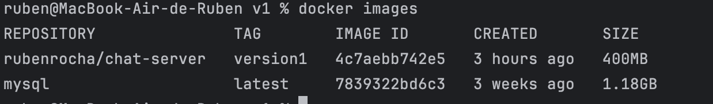
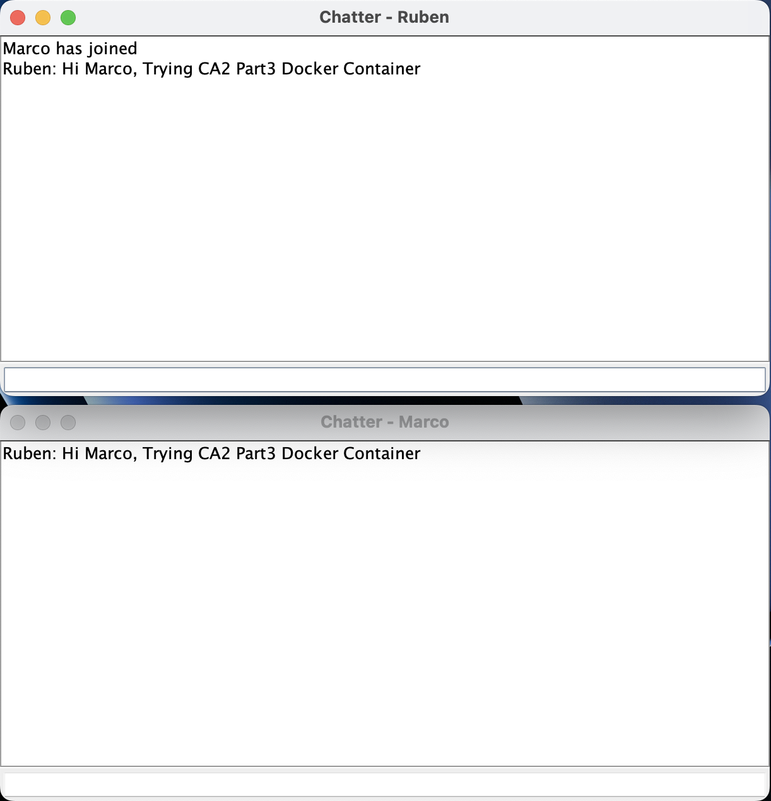
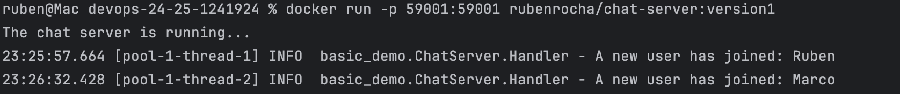
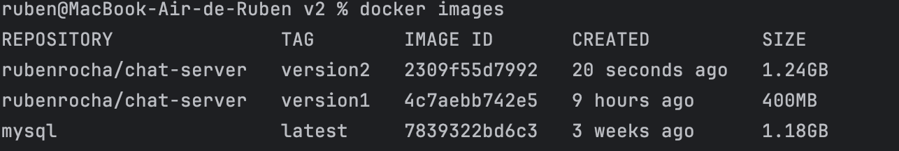
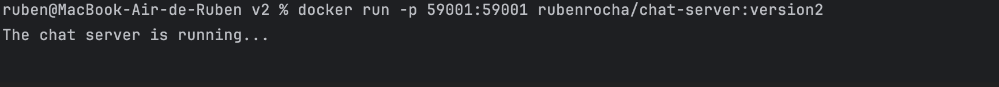
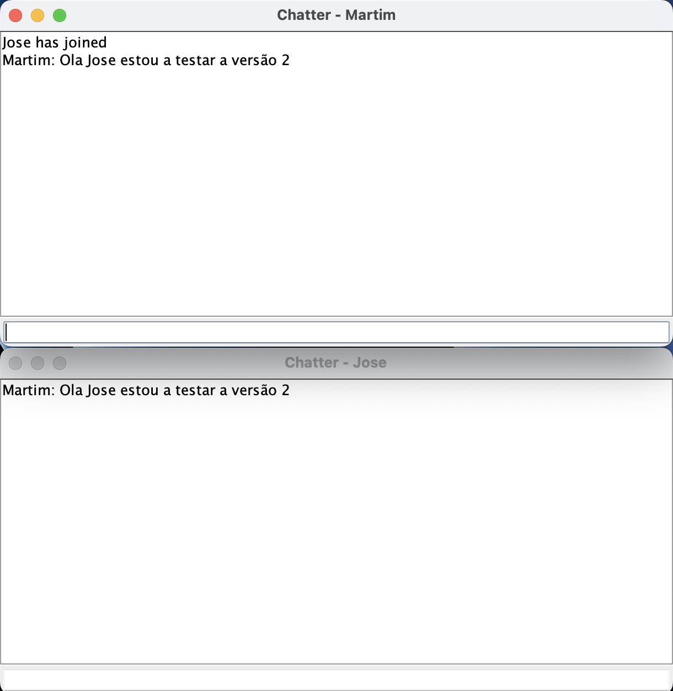
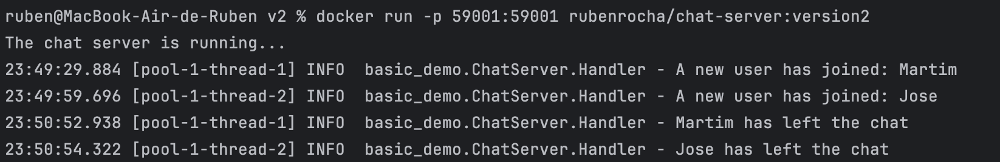
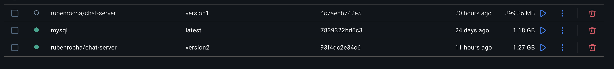

# _Part3 - Containers With Docker_

## Introduction to Part 3

This project focuses on gaining hands-on experience with Docker by containerizing a chat application.  
The chat server was originally developed as part of the CA2 coursework and is hosted in a Bitbucket repository.

This project explores two approaches to containerizing the application:

1. **Building the chat server within the Dockerfile**
2. **Compiling the chat server on the host machine and copying the JAR file into the Docker image**

By creating Docker images and running containers, the goal is to ensure the chat server runs consistently across different environments.


## Table of Contents
- [Environment Setup](#environment-setup)
- [Version1 - DockerFile](#version1---dockerfile)
  - [DockerFile Content](#dockerfile-content)
  - [DockerImage Built](#dockerimage-built)
  - [Running The Container](#running-the-container)
  - [Testing the Chat Functionality](#testing-the-chat-functionality)
- [Version2 - DockerFile](#version2---dockerfile)
  - [DockerFile Content](#dockerfile-content-1)
  - [DockerImage Built](#dockerimage-built-1)
  - [Running The Container](#running-the-container-1)
  - [Testing the Chat Functionality](#testing-the-chat-functionality-1)

---

## Environment Setup

To set up a development environment using Docker, follow these steps:

1. **Install Docker**  
   Download and install Docker Desktop from the [official Docker website](https://www.docker.com/products/docker-desktop). Follow the installation instructions for your operating system.

2. **Verify Installation**  
   After installation, verify that Docker is installed and running by executing the following command:
```bash
   docker --version
```

---

## Version1 - DockerFile

### DockerFile Content

```dockerfile
# Use a Gradle image with JDK 17 to build the application
FROM gradle:jdk17 AS builder

# Set the working directory for the build
WORKDIR /CA2/Part3/V1

# Clone the repository
RUN git clone https://bitbucket.org/pssmatos/gradle_basic_demo.git

# Set the working directory to the cloned repository
WORKDIR /CA2/Part3/V1/gradle_basic_demo

# Ensure the Gradle wrapper has the correct permissions
RUN chmod +x gradlew

# Build the application
RUN ./gradlew build

# Use a slim JRE image for the runtime
FROM eclipse-temurin:17-jre

# Set the working directory
WORKDIR /app

# Copy the built JAR file from the builder stage
COPY --from=builder /CA2/Part3/V1/gradle_basic_demo/build/libs/basic_demo-0.1.0.jar /app/basic_demo-0.1.0.jar

# Expose the port the server will run on
EXPOSE 59001

# Set the entry point to run the server
ENTRYPOINT ["java", "-cp", "/app/basic_demo-0.1.0.jar", "basic_demo.ChatServerApp", "59001"]
```

The `Dockerfile` is a script that defines the steps to build a Docker image for the chat server.

It begins by using a Gradle image with JDK 17 to clone the project from the Bitbucket repository and compile it.  
After the build process is completed, it transitions to a lightweight JRE base image to produce a smaller, optimized container for production use.

The generated `.jar` file is then copied from the build stage to the final image, and the server is set to run on port `59001`.

---

### DockerImage Built

```bash
docker build -t rubenrocha/chat-server:version1 . 
```

The `-t` flag is used to tag the image with a name and version. In this case, the image is tagged as `rubenrocha/chat-server:version1.`

To confirm that the Docker image was successfully built, I used the following command:

```bash
docker images
```

Below is the output of the command, which shows the newly created Docker image:



---

### Running The Container

```bash
docker run -p 59001:59001 rubenrocha/chat-server:version1
```

The `-p` flag is used to map the host port to the container port. In this case, port 59001 on the host is mapped to port 59001 on the container. 
Below is the output of the command, which shows the Docker container running the chat server:


---

### Testing the Chat Functionality

In a separate terminal window, I navigated to the directory containing the chat client and executed the following commands to build and run it:

```bash
./gradlew build
./gradlew runClient
```

To test the chat server, I connected two separate clients to it.  
One of the clients was connected to the chat server running inside the Docker container.

Below is a sample output from the chat client showing a successful connection and a sample message exchange:



In the terminal where the Docker container was running, I could see the entrance of new clients in the chat server.


---

## Version2 - DockerFile

For the second version of the project, I compiled the chat server on my local (host) machine and then copied the resulting JAR file into the Docker image.

First, I navigated to the project directory and ran the Gradle build command to generate the JAR file:

```bash
./gradlew build
```

This generated the `basic_demo-0.1.0.jar` file in the `build/libs` directory.

I then navigated to the directory where my Dockerfile for version 2 was located.

### DockerFile Content

```dockerfile
# Use a Gradle image with JDK 21 to build the application
FROM gradle:jdk21 AS builder

# Set the working directory
WORKDIR /app

# Copy the JAR file from the host machine to the Docker image
COPY CA1/part2/gradle-basic/build/libs/basic_demo-0.1.0.jar /app/basic_demo-0.1.0.jar

# Expose the port the server will run on
EXPOSE 59001

# Set the entry point to run the server
ENTRYPOINT ["java", "-cp", "/app/basic_demo-0.1.0.jar", "basic_demo.ChatServerApp", "59001"]
```

This version of the `Dockerfile` is more straightforward compared to the previous one, as it doesn't require cloning the repository or building the project.

Instead, it simply copies the JAR file—previously generated by the Gradle build command on the host machine—into the Docker image.  
The server is then configured to run on port `59001`, just like in the first version.

### DockerImage Built

Inside the directory where my Dockerfile for version 2 was located.

```bash
docker build -t rubenrocha/chat-server:version2 -f Dockerfile ../../..
```

When building the Docker image, the `-t` flag is used to assign a name and version tag to the image.  
In this case, the image is tagged as:
`rubenrocha/chat-server:version2`

The `-f` flag specifies the path to the Dockerfile to be used in the build.

The `../../..` part sets the build context to three directories above the current one, ensuring that all required files (such as the pre-built JAR) are available during the image build process.

The image below shows the newly created Docker image:



---

### Running The Container

```bash
docker run -p 59001:59001 rubenrocha/chat-server:version2
```

Docker container running successfully, as shown below:



---

### Testing the Chat Functionality

I navigated to the directory where the chat client is located and executed the following commands to run it:

```bash
./gradlew runClient
```

I opened two clients in two different terminals to test the chat functionality. Below is the output of the chat:



In the terminal where the Docker container was running, I could see the entrance and exit of new clients in the chat:




All Docker images created during this project can be easily viewed and managed using Docker Desktop.  
The application provides a graphical interface that displays all local images, along with their tags, sizes, and creation dates, making it simple to inspect and manage containers visually.

Below is a screenshot showing the Docker images created for this project:



---

## Conclusion

In this assignment, I successfully containerized a chat server application using Docker.  
By following a structured process, I created two different versions of the Docker image:

- **Version 1**: Built the application directly within the Dockerfile.
- **Version 2**: Compiled the application on the host machine and copied the generated JAR file into the Docker image.

Both methods showcased Docker’s flexibility and effectiveness in ensuring consistent deployment and execution of applications across different environments.


