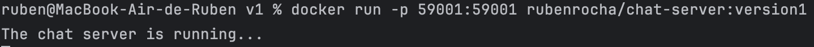

# _Part3 - Containers With Docker_

## Introduction to Part 3

This project focuses on gaining hands-on experience with Docker by containerizing a chat application.  
The chat server was originally developed as part of the CA2 coursework and is hosted in a Bitbucket repository.

This project explores two approaches to containerizing the application:

1. **Building the chat server within the Dockerfile**
2. **Compiling the chat server on the host machine and copying the JAR file into the Docker image**

By creating Docker images and running containers, the goal is to ensure the chat server runs consistently across different environments.


## Table of Contents
- [Environment Setup](#environment-setup)
- [Version1 - DockerFile](#version1---dockerfile)
  - [DockerFile Content](#dockerfile-content)
  - [DockerImage Built](#dockerimage-built)
  - [Running The Container](#running-the-container)
  - [Testing the Chat Functionality](#testing-the-chat-functionality)
- [Version2 - DockerFile]

---

## Environment Setup

To set up a development environment using Docker, follow these steps:

1. **Install Docker**  
   Download and install Docker Desktop from the [official Docker website](https://www.docker.com/products/docker-desktop). Follow the installation instructions for your operating system.

2. **Verify Installation**  
   After installation, verify that Docker is installed and running by executing the following command:
```bash
   docker --version
```
---

## Version1 - DockerFile

### DockerFile Content

```dockerfile
 # Use a Gradle image with JDK 17 to build the application
 FROM gradle:jdk17 AS builder

 # Set the working directory for the build
 WORKDIR /CA4/Part1/V1
 
 # Clone the repository
 RUN git clone https://bitbucket.org/pssmatos/gradle_basic_demo.git
 
 # Set the working directory to the cloned repository
 WORKDIR /CA4/Part1/V1/gradle_basic_demo
 
 # Ensure the Gradle wrapper has the correct permissions
 RUN chmod +x gradlew
 
 # Build the application
 RUN ./gradlew build
 
 # Use a slim JRE image for the runtime
 FROM eclipse-temurin:17-jre
 
 # Set the working directory
 WORKDIR /app
 
 # Copy the built JAR file from the builder stage
 COPY --from=builder /CA4/Part1/V1/gradle_basic_demo/build/libs/basic_demo-0.1.0.jar /app/basic_demo-0.1.0.jar
 
 # Expose the port the server will run on
 EXPOSE 59001
 
 # Set the entry point to run the server
 ENTRYPOINT ["java", "-cp", "/app/basic_demo-0.1.0.jar", "basic_demo.ChatServerApp", "59001"]
```

The `Dockerfile` is a script that defines the steps to build a Docker image for the chat server.

It begins by using a Gradle image with JDK 17 to clone the project from the Bitbucket repository and compile it.  
After the build process is completed, it transitions to a lightweight JRE base image to produce a smaller, optimized container for production use.

The generated `.jar` file is then copied from the build stage to the final image, and the server is set to run on port `59001`.

---

### DockerImage Built

```bash
docker build -t rubenrocha/chat-server:version1 . 
```

The `-t` flag is used to tag the image with a name and version. In this case, the image is tagged as `rubenrocha/chat-server:version1.`

To confirm that the Docker image was successfully built, I used the following command:

```bash
docker images
```

Below is the output of the command, which shows the newly created Docker image:


---

### Running The Container

```bash
docker run -p 59001:59001 rubenrocha/chat-server:version1
```

The `-p` flag is used to map the host port to the container port. In this case, port 59001 on the host is mapped to port 59001 on the container. 
Below is the output of the command, which shows the Docker container running the chat server:



---

### Testing the Chat Functionality

In a separate terminal window, I navigated to the directory containing the chat client and executed the following commands to build and run it:

```bash
./gradlew build
./gradlew runClient
```

To test the chat server, I connected two separate clients to it.  
One of the clients was connected to the chat server running inside the Docker container.

Below is a sample output from the chat client showing a successful connection and a sample message exchange:


In the terminal where the Docker container was running, I could see the entrance of new clients in the chat server.


