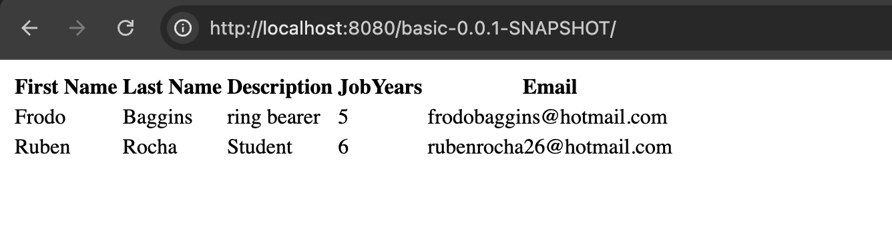
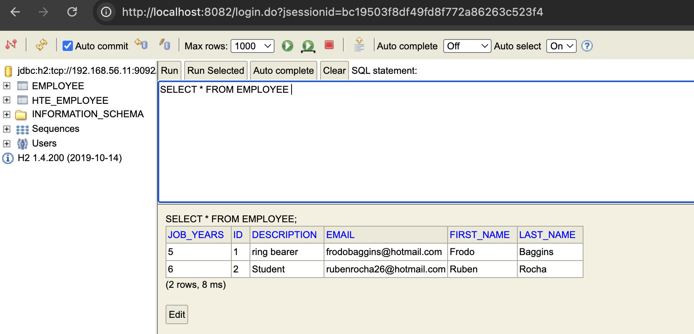
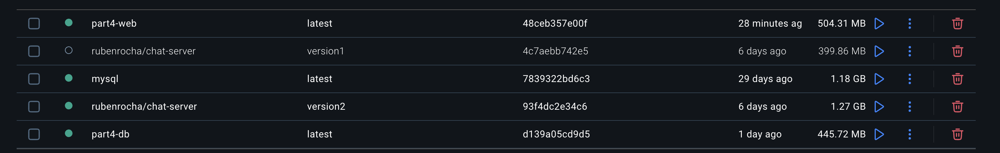
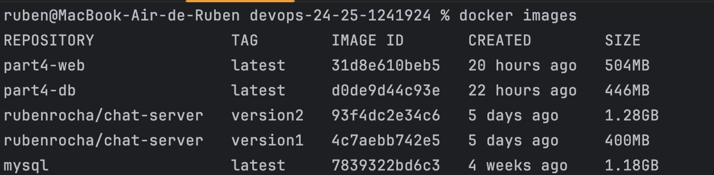
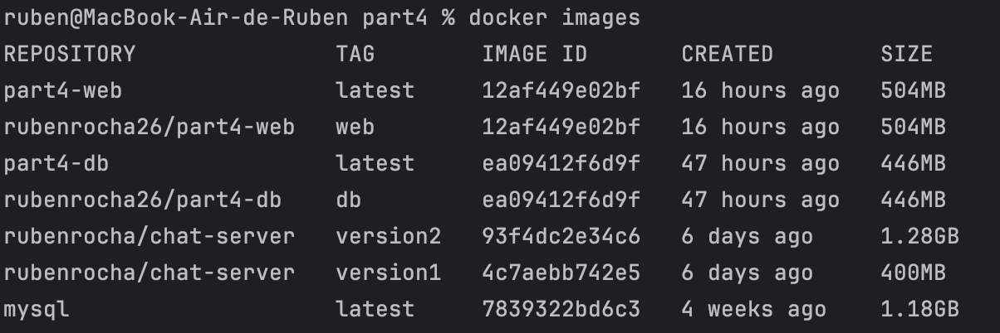
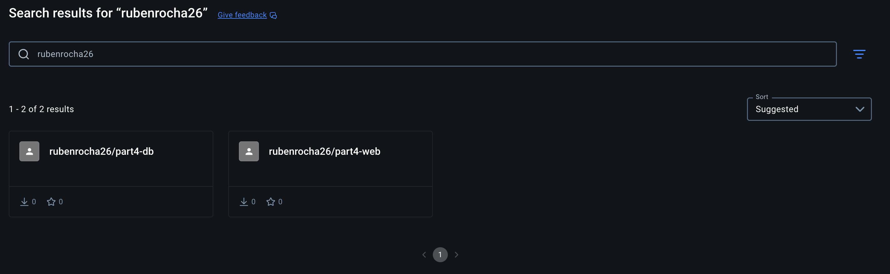

# _Part 4 - Containerizing Applications with Docker, Docker Compose, and Kubernetes_

## Introduction to Part 4

This report outlines the process of containerizing a full-stack web application with its database using Docker.  
The main objective was to showcase how to package, deploy, and manage both services in isolated containers, ensuring portability and consistency.

Additionally, an alternative deployment method using **Kubernetes**—a cloud platform that simplifies application deployment—was explored.

The following aspects are covered in this report:

- Creation of Dockerfiles for the web application and the database
- Configuration of Docker Compose to orchestrate the multi-container environment
- Tagging and pushing Docker images to a remote repository
- Deployment using Kubernetes for comparison

By completing these steps, I developed a deeper understanding of containerization concepts and modern deployment workflows.

## Table of Contents
- [Dockerfile for the Database Service](#dockerfile-for-the-database-service)
  - [Dockerfile Content](#dockerfile-content)
  - [Explanation of the Dockerfile](#explanation-of-the-dockerfile)
- [Web Application Dockerfile](#web-application-dockerfile)
  - [Dockerfile Content](#dockerfile-content-1)
  - [Explanation of the Dockerfile](#explanation-of-the-dockerfile-1)
- [Docker Compose](#docker-compose)
  - [Docker Compose file Content](#docker-compose-file-content)
  - [Explanation](#explanation)
  - [Building and Running the Services](#building-and-running-the-services)
- [Tagging and Pushing Images to Docker Hub](#tagging-and-pushing-images-to-docker-hub)
  - [Verifying Images in Docker Desktop](#1-verifying-images-in-docker-desktop)
  - [Tagging the Images](#2-tagging-the-images)
  - [Pushing the Images](#3-pushing-the-images)
- [Verifying Database File Placement in the Volume](#verifying-database-file-placement-in-the-volume)
  - [Accessing the DB Container](#accessing-the-db-container)
  - [Copying the H2 JAR File to the Volume](#copying-the-h2-jar-file-to-the-volume)
- [Alternative Solution - Kubernetes](#alternative-solution---kubernetes)
- [Conclusion](#conclusion)


## Dockerfile for the Database Service

I began by creating a `Dockerfile` for the database service, which in this case was an **H2 database server**.

The `Dockerfile` was placed in the `db` directory and contains the following content:

### DockerFile Content

```dockerfile
FROM amazoncorretto:17-alpine

WORKDIR /h2

RUN apk add --no-cache wget && \
    wget https://repo1.maven.org/maven2/com/h2database/h2/1.4.200/h2-1.4.200.jar && \
    apk del wget

EXPOSE 8082 9092

CMD ["java", "-cp", "h2-1.4.200.jar", "org.h2.tools.Server", "-web", "-webAllowOthers", "-tcp", "-tcpAllowOthers", "-ifNotExists"]
```

### Explanation of the Dockerfile

- **Base Image**: The image uses `amazoncorretto` as the base to ensure a clean and up-to-date environment.
- **Working Directory**: The `/h2` directory is used as the working directory for the application files.
- **Download H2 Database**: The H2 database JAR file is downloaded directly from the Maven repository.
- **Port Exposure**: Ports `8082` (for web access) and `9092` (for TCP access) are exposed to allow external connections.
- **Start Command**: The container runs the H2 database server with parameters that:
    - Enable web and TCP connections,
    - Allow connections from external machines,
    - Create the database if it doesn't already exist.

---

## Web Application Dockerfile

Then, I created a `Dockerfile` in a `web` directory with the following content:

### DockerFile Content

```dockerfile
FROM eclipse-temurin:17-jdk AS builder

# Create a directory for the project
WORKDIR /web

# Copy the repository and navigate to the project directory
COPY CA1/part3/react-and-spring-data-rest-basic /web

# Navigate to the project directory
WORKDIR /web

# Change the permissions of the gradlew file to make it executable
RUN chmod +x gradlew

# Run the gradle build command
RUN ./gradlew build --no-daemon

FROM eclipse-temurin:17-jre

# Copy the generated JAR file to the Tomcat webapps directory
WORKDIR /web

COPY --from=builder /web/build/libs/*jar app.jar
# State the port that our application will run on
EXPOSE 8080

# Start Tomcat automatically when the container starts
CMD ["java", "-jar", "app.jar"]
```

### Explanation of the Dockerfile

- **Base Image**: `eclipse-temurin:17-jdk` provides the environment necessary to compile and run Java applications.
- **Directory Setup**: A directory `/web` is created to house the application source files.
- **Copy Repository**: The application repository is copied from `MyMachine` into the working directory.
- **Build Project**: The script navigates into the project directory, makes the Gradle wrapper executable, and runs the build using `./gradlew build` to generate the Jar file.
- **Final Stage**: Copies the generated JAR file to the container and sets it up to be executed.
- **Embedded Server**: The application uses the embedded Tomcat server provided by Spring Boot, so no external Tomcat setup is required.
- **Port Exposure**: Port `8080` is exposed to allow external HTTP traffic to reach the application.

---

## Docker Compose

To manage both the database and the web application containers, I created a `docker-compose.yml` file.  
This file defines the two services—**db** and **web**—and specifies how they interact with each other, including networking, port mapping, and build context.  
Using Docker Compose simplifies the orchestration process by allowing both containers to be launched and managed together with a single command.

### Docker Compose file Content

```dockerfile
version: '3.8'

services:

  db:
    build: ./db
    ports:
      - "8082:8082"
      - "9092:9092"
    volumes:
      - ./data:/usr/src/data-backup
    networks:
      my_own_network:
        ipv4_address: 192.168.56.11

  web:
    build:
      context: ../../
      dockerfile: CA2/Part4/web/Dockerfile
    ports:
      - "8080:8080"
    networks:
      - my_own_network
    depends_on:
      - db

networks:
  my_own_network:
    driver: bridge
    ipam:
      config:
          - subnet: "192.168.56.0/24"
```

### Explanation

- **Version**:  
  The `docker-compose.yml` file uses version `3.8` to ensure compatibility with the features utilized.

- **Services**:

- **DB Service**:
  - Built from the `./db` directory.
  - Maps container ports `8082` (web interface) and `9092` (TCP server) to the host.
  - A volume is mounted to persist database data across restarts.
  - Connected to `my_custom_network` with a static IP `192.168.56.11`.

- **Web Service**:
  - Built from the `./web` directory.
  - Maps container port `8080` to the host for web access.
  - The service is also connected to the custom network `my_own_network`, allowing it to communicate securely with the database service.
  - Depends on the `db` service, ensuring the database starts before the web application.

- **Networks**:
- **my_custom_network**:
  A custom network `my_own_network` is defined with a subnet `192.168.56.0/24`, ensuring both services can communicate with each other within a dedicated network space. 
- The bridge driver is used for network isolation between containers.

### Building and Running the Services

To build and run the services defined in the `docker-compose.yml` file, I executed the following command:

```bash
docker-compose up --build
```

When the service was running, I could access the web application at http://localhost:8080/basic-0.0.1-SNAPSHOT/ and the H2 database console at http://localhost:8082.
Below are screenshots showing successful access to the web application and the H2 database console:





---

## Tagging and Pushing Images to Docker Hub

To ensure the Docker images were correctly tagged and uploaded to Docker Hub, I used Docker Desktop, which provides a user-friendly interface for managing local images.

### 1. Verifying Images in Docker Desktop

After building the images, I opened Docker Desktop to verify that the web and database images were listed.  
Docker Desktop displays image names, tags, sizes, and creation times, making it easy to confirm their presence as shown below:



Also, it can be seen from terminal line:



### 2. Tagging the Images

Although Docker Desktop shows the images, tagging is still required for pushing them to Docker Hub.  
This can be done using the CLI or directly through Docker Desktop:

**Using CLI:**
```bash
docker tag <image-id> username/image-name:tag
```

So, I tagged the images with the correct repository name and tag: 

```bash
docker tag 12af449e02bf rubenrocha26/part4-web:web
docker tag ea09412f6d9f rubenrocha26/part4-db:db
```

These commands assigned the `web` tag to the `part4-web` image and the `db` tag to the `part4-db` image, which is shown in the output of the `docker images` command.



When you use the `docker tag` command, it does not create a new image but simply assigns a new tag to the same existing image. 
This means the image ID remains the same, and no duplication occurs.

### 3. Pushing the Images

Before pushing the images, I logged into my Docker Hub account with the command:

```bash
docker login
```

Finally, I pushed the images to the Docker Hub repository using the following commands:

```bash
docker push rubenrocha26/part4-web:web
docker push rubenrocha26/part4-db:db
```

These commands uploaded the `part4-web` image with the `web` tag and the `part4-db` image with the `db` tag to my repository on Docker Hub.

Below is a screenshot showing the successful push of the images to Docker Hub:



---

## Verifying Database File Placement in the Volume

To ensure that the database file was correctly placed in the mounted volume, I used the `docker-compose exec` command to access the running database container and manually inspect the file system.

### Accessing the DB Container

I executed the following command to open a shell inside the running `db` container:

```bash
docker-compose exec db sh
```

### Copying the H2 JAR File to the Volume

Inside the container shell, I manually copied the `h2-1.4.200.jar` file to the mounted volume directory to ensure it was properly accessible for future use and persisted across container restarts.

```bash
cp g2-1.4.200.jar /usr/src/data-backup
exit
```

This command sequence enters the `db` container, copies the specified file to the volume directory, and then exits the container shell.

By doing so, it ensures that the H2 database JAR file is correctly placed within the persistent volume, effectively backing it up to the host system.

This setup guarantees that even if the container is removed or recreated, the necessary database file remains intact and accessible for subsequent runs.

---

## Alternative Solution - Kubernetes

**Kubernetes** is an open-source container orchestration platform originally developed by Google. 
It automates the deployment, scaling, load balancing, and management of containerized applications.

Unlike Docker Compose, which is mainly used for defining and running multi-container Docker applications on a single host, Kubernetes is designed to manage containers across multiple hosts in a cluster. 
It provides advanced features such as:

- **Self-healing**: Automatically restarts failed containers.
- **Scaling**: Dynamically scales applications based on demand.
- **Load Balancing**: Distributes traffic efficiently across services.
- **Rolling Updates**: Deploys application updates without downtime.
- **Secret and Config Management**: Manages environment configurations securely.

While Docker Compose is great for local development and simple environments, Kubernetes is better suited for production environments that require scalability, high availability, and complex orchestration.

---

## Conclusion

This project provided practical experience in containerizing a web application and database using Docker and orchestrating them with Docker Compose.  
By building Dockerfiles, configuring persistent volumes, and deploying through Compose, I deepened my understanding of modern DevOps practices.  
Additionally, by exploring Kubernetes as an alternative deployment solution, I gained insight into scalable and resilient application orchestration suitable for production environments.

