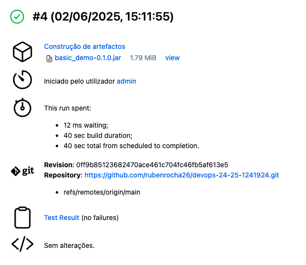
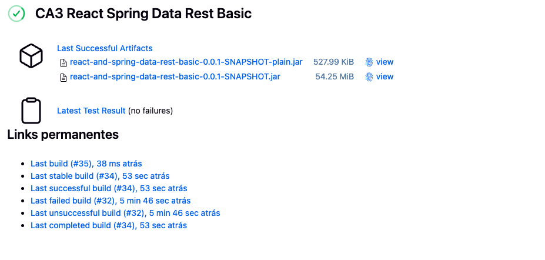

# _CI/CD Pipelines with Jenkins_

## Introduction to CA3

The objective of this assignment was to configure CI/CD pipelines using **Jenkins** for two applications developed in previous coursework. These include:

- The **Gradle Basic Demo Application** (from CA1 - Part 2)
- The **React and Spring Data REST Basic Application** (from CA1 - Part 3)

This practical assignment aims to deepen the understanding of Continuous Integration and Continuous Deployment (CI/CD) principles by applying them in a real-world context. 
The focus is on automating key stages of the software lifecycle—**build**, **test**, and **deployment**—using Jenkins as the orchestration tool.

This document provides a step-by-step overview of the pipeline setup and configuration. 
It is intended as a comprehensive guide, demonstrating how Jenkins can be used to streamline and automate the delivery workflow for both frontend and backend applications.


## Table of Contents
- [Setting Up](#setting-up)
- [Jenkins Pipeline for Gradle Basic Demo](#jenkins-pipeline-for-gradle-basic-demo)
  - [Pipeline Stages Overview](#pipeline-stages-overview)
  - [Creating the Pipeline Job in Jenkins](#creating-the-pipeline-job-in-jenkins)
  - [Executing the Pipeline](#executing-the-pipeline)
- [Jenkins Pipeline for React and Spring Data REST](#jenkins-pipeline-for-react-and-spring-data-rest-application)
  - [Pipeline Stages Overview](#pipeline-stages-overview-1)
  - [Configuring Docker Credentials in Jenkins](#configuring-docker-credentials-in-jenkins)
  - [Creating the Pipeline Job in Jenkins](#creating-the-pipeline-job-in-jenkins-1)
  - [Executing the Pipeline](#executing-the-pipeline-1)
- [Conclusion](#conclusion)


---

## Setting Up

To successfully configure Jenkins and implement the CI/CD pipeline, it was necessary to install and verify the following tools:

- **Git**: Used for version control and repository management. The installation was verified by executing the command `git --version`.

- **Docker**: Required for building and running containerized applications. The Docker installation was confirmed with the command `docker --version`.

- **Jenkins**: Served as the core automation server for orchestrating the CI/CD pipeline. 
Jenkins was installed locally, and its successful setup was verified by accessing the Jenkins dashboard through a web browser.

---

## Jenkins Pipeline for Gradle Basic Demo

The initial stage of the CA3 assignment focused on configuring a Jenkins pipeline for the **Gradle Basic Demo Application**, previously developed in CA1/Part2.

The pipeline was defined through a `Jenkinsfile` placed inside CA3/gradle_basic_demo directory. This file outlines the steps Jenkins must follow to execute the CI/CD workflow for this application.

Below is the content of the `Jenkinsfile` used:

```groovy
pipeline {
    agent any

    tools{
        jdk 'JDK17'
    }

    environment{
        JAVA_HOME = tool 'JDK17'
        PATH = "${JAVA_HOME}/bin:${env.PATH}"
    }

    stages {
        stage('Checkout') {
            steps {
                echo 'Checking out from repository'
                git branch: 'main', url: 'https://github.com/rubenrocha26/devops-24-25-1241924.git'
            }
        }
        stage('Assemble') {
            steps {
                dir('CA1/Part2/gradle-basic') {
                    echo 'Assembling...'
                    sh 'chmod +x gradlew'
                    sh './gradlew clean assemble'
                }
            }
        }
        stage('Test') {
            steps {
                dir('CA1/Part2/gradle-basic') {
                    echo 'Running Tests...'
                    sh './gradlew test'
                    junit 'build/test-results/test/*.xml'
                }
            }
        }
        stage('Archive') {
            steps {
                dir('CA1/Part2/gradle-basic') {
                    echo 'Archiving artifacts...'
                    archiveArtifacts artifacts: 'build/libs/*.jar', allowEmptyArchive: true
                }
            }
        }
    }
}
```

### Pipeline Stages Overview

The `Jenkinsfile` for the Gradle Basic Demo Application defined a pipeline composed of four sequential stages:

1. **Checkout**  
   In this initial stage, the project source code was retrieved from the corresponding GitHub repository using the Git plugin.

2. **Assemble**  
   This stage executed the command `./gradlew clean assemble` to clean the project and compile all necessary artifacts.

3. **Test**  
   The test suite for the Gradle project was executed with `./gradlew test`, ensuring that the application behaved as expected before proceeding to the next step.

4. **Archive**  
   Finally, the generated `.jar` file was archived as a build artifact. This allows future retrieval and deployment without requiring a rebuild.

### Creating the Pipeline Job in Jenkins

To create a new pipeline job in Jenkins, the following steps were performed:

1. Accessed the Jenkins dashboard and clicked on **"New Item"**.
2. Provided a name for the pipeline job and selected the **"Pipeline"** option.
3. Under the **Pipeline** configuration section, selected **"Pipeline script from SCM"** as the definition source.
4. Chose **Git** as the Source Code Management (SCM) option.
5. Entered the repository URL where the project is hosted.
6. Specified `main` as the branch to track.
7. Set the **Script Path** to `CA3/gradle_basic_demo/Jenkinsfile` to point Jenkins to the location of the pipeline definition within the repository.
8. Saved the configuration to finalize the job setup.

### Executing the Pipeline

Once the pipeline job was configured, the build process was initiated by clicking on **"Build Now"**. 
The progress and output of each stage were monitored through the **Jenkins Console Output**, which provided real-time feedback on the execution.

Below is a screenshot illustrating the Jenkins pipeline job after a successful build:



---


## Jenkins Pipeline for React and Spring Data REST Application

The second component of the CA3 assignment focused on configuring a Jenkins pipeline for the **React and Spring Data REST Basic Application**, previously developed in CA1/Part3.

The pipeline was defined using a `Jenkinsfile` located within the project directory. 
This file specifies the full CI/CD process, automating the build, test, and documentation generation steps for both the backend and frontend components of the application.

Below is the content of the `Jenkinsfile` used:

```groovy
pipeline {
    agent any

    environment {
        PATH = "/usr/local/bin:$PATH"
        DOCKER_CREDENTIALS_ID = 'dockerhub-credentials-id'
        DOCKER_IMAGE          = 'rubenrocha26/ca3-springboot-app'
        DOCKER_REGISTRY       = 'https://index.docker.io/v1/'
        REPO_URL              = 'https://github.com/rubenrocha26/devops-24-25-1241924.git'
    }

    stages {

        stage('Checkout') {
            steps {
                echo 'Checking out...'
                git branch: 'main', url: env.REPO_URL
            }
        }

        stage('Create Dockerfile') {
            steps {
                dir('CA1/part3/react-and-spring-data-rest-basic') {
                    echo 'Writing Dockerfile...'
                    script {
                        writeFile file: 'Dockerfile', text: '''
   FROM eclipse-temurin:21-jdk
   WORKDIR /app
   COPY build/libs/*.jar app.jar
   EXPOSE 8080
   ENTRYPOINT ["java","-jar","app.jar"]
   '''
                    }
                }
            }
        }

        stage('Assemble') {
            steps {
                dir('CA1/part3/react-and-spring-data-rest-basic') {
                    echo 'Assembling...'
                    sh 'chmod +x gradlew'
                    sh './gradlew clean assemble'
                }
            }
        }

        stage('Test') {
            steps {
                dir('CA1/part3/react-and-spring-data-rest-basic') {
                    echo 'Testing...'
                    sh './gradlew test'
                    junit '**/build/test-results/test/*.xml'
                }
            }
        }

        stage('Javadoc') {
            steps {
                dir('CA1/part3/react-and-spring-data-rest-basic') {
                    echo 'Generating Javadoc…'
                    sh './gradlew javadoc'
                    publishHTML(target: [
                        allowMissing: false,
                        alwaysLinkToLastBuild: true,
                        keepAll: true,
                        reportDir:   'build/docs/javadoc',
                        reportFiles: 'index.html',
                        reportName:  'Javadoc'
                    ])
                }
            }
        }

        stage('Archive') {
            steps {
                dir('CA1/part3/react-and-spring-data-rest-basic') {
                    echo 'Archiving...'
                    archiveArtifacts artifacts: 'build/libs/*.jar', fingerprint: true
                }
            }
        }

        stage('Build Docker Image') {
            steps {
                dir('CA1/part3/react-and-spring-data-rest-basic') {
                    echo 'Building & Pushing Docker image...'
                    withCredentials([usernamePassword(credentialsId: env.DOCKER_CREDENTIALS_ID, usernameVariable: 'DOCKER_USERNAME', passwordVariable: 'DOCKER_PASSWORD')]) {
                        script {
                            def dockerBin = '/usr/local/bin/docker'
                            def imageTag = "${env.DOCKER_IMAGE}:${env.BUILD_NUMBER}"

                            sh "${dockerBin} build -t ${imageTag} ."
                            sh "echo \$DOCKER_PASSWORD | ${dockerBin} login ${env.DOCKER_REGISTRY} -u \$DOCKER_USERNAME --password-stdin"
                            sh "${dockerBin} push ${imageTag}"
                        }
                    }
                }
            }
        }
    }

    post {
        always {
            cleanWs()
        }
    }
}
```

### Pipeline Stages Overview

1. **Checkout**  
   Retrieves the source code from the GitHub repository specified by the `REPO_URL` environment variable.

2. **Create Dockerfile**  
   Dynamically creates a `Dockerfile` for the Spring Boot application, configuring it to package the generated JAR and expose port 8080.

3. **Assemble**  
   Builds the project using Gradle via `./gradlew clean assemble`, compiling both frontend and backend components.

4. **Test**  
   Executes unit tests with `./gradlew test` and collects the results using the `junit` step.

5. **Javadoc**  
   Generates the Java documentation with `./gradlew javadoc` and attempts to publish it using the `publishHTML` step (requires the HTML Publisher Plugin).

6. **Archive**  
   Archives the compiled JAR file (`build/libs/*.jar`) as a Jenkins build artifact, enabling future access without recompilation.

7. **Build Docker Image**  
   Builds a Docker image using the previously created `Dockerfile`, tags it with the Jenkins build number, and pushes it to Docker Hub using stored credentials.


### Configuring Docker Credentials in Jenkins

To enable Jenkins to authenticate with Docker Hub and push images, Docker credentials were configured as follows:

1. Accessed the Jenkins dashboard and navigated to:  
   **Manage Jenkins** > **Manage Credentials** > **System** > **Global credentials (unrestricted)**.

2. Clicked on **Add Credentials**.

3. In the **Kind** field, selected **Username with password**.

4. Entered the Docker Hub **username** and **password**.

5. Set the **ID** to `docker-credentials`, ensuring it matches the value referenced in the `Jenkinsfile`.

6. Clicked **OK** to save the credentials.

This configuration allows the pipeline to authenticate securely with Docker Hub during the **Build Docker Image** stage using the `withCredentials` block.


### Creating the Pipeline Job in Jenkins

To set up the pipeline for the React and Spring Data REST application, a new pipeline job was created in Jenkins through the following steps:

1. Acedi ao **Jenkins Dashboard** e cliquei em **"New Item"**.

2. Introduzi um nome para o novo job e selecionei a opção **"Pipeline"**.

3. Na secção **Pipeline**, escolhi a definição **"Pipeline script from SCM"**.

4. No campo **SCM**, selecionei **Git** e introduzi o URL do repositório.

5. Especifiquei o branch como `main`.

6. Defini o campo **Script Path** como:  
   `CA3/react-and-spring-data-rest-basic/Jenkinsfile`

7. Por fim, cliquei em **Save** para guardar e ativar a configuração do pipeline.

Esta configuração permite que o Jenkins execute automaticamente o pipeline definido no `Jenkinsfile` sempre que for acionado manualmente ou por um trigger de SCM.


### Executing the Pipeline

After configuring the pipeline job, the build was manually triggered by clicking on **"Build Now"** within the Jenkins interface.  
The progress of the execution was monitored through the **Console Output**, which provided detailed feedback on each stage of the pipeline.

Below is a screenshot illustrating the Jenkins pipeline job following a successful build:



---

## Conclusion

This assignment offered valuable hands-on experience in the configuration of CI/CD pipelines using Jenkins, applied to two distinct applications. 
By setting up automated pipelines for both the **Gradle Basic Demo Application** and the **React and Spring Data REST Basic Application**, I was able to consolidate my understanding of the fundamental concepts and practices of Continuous Integration and Continuous Deployment.

The configuration process involved defining multiple stages within the `Jenkinsfile`, executing build and test commands, generating documentation, archiving artifacts, and building and pushing Docker images. 
These automated workflows demonstrated how Jenkins can streamline the software development lifecycle by reducing manual effort, minimizing the risk of human error, and accelerating delivery times.

Overall, this experience reinforced the importance of automation in modern software engineering and highlighted Jenkins as a powerful tool for achieving efficient and reliable CI/CD pipelines.
